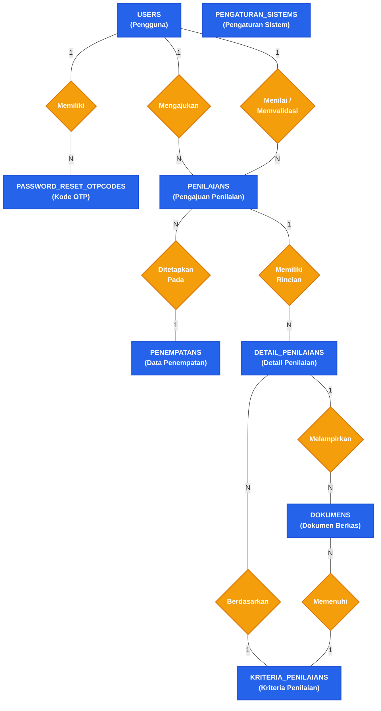

# ENTITY RELATIONSHIP DIAGRAM (ERD) — NOTASI CHEN (CHEN'S STYLE)
## Sistem Informasi Penilaian (SIPENA)

> **Kaidah Notasi Chen (Peter Chen)**:
> - 🟦 **Entitas (Entity)** = Persegi Panjang `[ Nama Entitas ]`
> - 🔶 **Relasi (Relationship)** = Belah Ketupat `{ Nama Relasi }`
> - 🟡 **Atribut (Attribute)** = Elips / Oval `( Nama Atribut )`
> - 🔑 **Primary Key (PK)** = Ditandai dengan garis bawah `(<u>id</u>)`
> - 🔗 **Kardinalitas** = Diberi label `1` (One) ke `N` / `M` (Many) pada garis penghubung

---

## 1. Diagram ERD Utama (Notasi Chen - Hubungan Antar Entitas & Relasi)

Diagram di bawah menunjukkan peta relasi antar entitas utama sistem penilaian:

---

## 2. Diagram Rinci Entitas Beserta Seluruh Atribut (Chen Style Lengkap)

Berikut adalah dekomposisi lengkap setiap Entitas, Atribut Key (PK), Atribut Deskriptif, dan Relasi:

```mermaid
flowchart TB
    %% Styling Class Definitions
    classDef entitas fill:#1e40af,stroke:#1e3a8a,stroke-width:2.5px,color:#ffffff,font-weight:bold;
    classDef relasi fill:#d97706,stroke:#b45309,stroke-width:2px,color:#ffffff,font-weight:bold;
    classDef pk fill:#fef08a,stroke:#ca8a04,stroke-width:2px,color:#854d0e,font-weight:bold,text-decoration:underline;
    classDef atribut fill:#f1f5f9,stroke:#64748b,stroke-width:1.2px,color:#0f172a;

    %% ==========================================
    %% 1. ENTITAS USER & ATRIBUT
    %% ==========================================
    U_ENT["USERS"]:::entitas
    U_PK(["<u>id (PK)</u>"]):::pk
    U_A1(["username"]):::atribut
    U_A2(["nama_lengkap"]):::atribut
    U_A3(["email"]):::atribut
    U_A4(["password"]):::atribut
    U_A5(["role"]):::atribut
    U_A6(["foto_profil"]):::atribut
    U_A7(["email_verified_at"]):::atribut

    U_ENT --- U_PK
    U_ENT --- U_A1
    U_ENT --- U_A2
    U_ENT --- U_A3
    U_ENT --- U_A4
    U_ENT --- U_A5
    U_ENT --- U_A6
    U_ENT --- U_A7

    %% ==========================================
    %% 2. ENTITAS OTP & ATRIBUT
    %% ==========================================
    OTP_ENT["PASSWORD_RESET_OTPCODES"]:::entitas
    OTP_PK(["<u>id (PK)</u>"]):::pk
    OTP_A1(["email"]):::atribut
    OTP_A2(["otpcode"]):::atribut
    OTP_A3(["expired_at"]):::atribut

    OTP_ENT --- OTP_PK
    OTP_ENT --- OTP_A1
    OTP_ENT --- OTP_A2
    OTP_ENT --- OTP_A3

    %% ==========================================
    %% 3. ENTITAS PENILAIAN & ATRIBUT
    %% ==========================================
    P_ENT["PENILAIANS"]:::entitas
    P_PK(["<u>id (PK)</u>"]):::pk
    P_A1(["total_bobot"]):::atribut
    P_A2(["flag_penilaian"]):::atribut
    P_A3(["user_id (FK)"]):::atribut
    P_A4(["penanggungjawab_id (FK)"]):::atribut
    P_A5(["penempatan_id (FK)"]):::atribut

    P_ENT --- P_PK
    P_ENT --- P_A1
    P_ENT --- P_A2
    P_ENT --- P_A3
    P_ENT --- P_A4
    P_ENT --- P_A5

    %% ==========================================
    %% 4. ENTITAS PENEMPATAN & ATRIBUT
    %% ==========================================
    PN_ENT["PENEMPATANS"]:::entitas
    PN_PK(["<u>id (PK)</u>"]):::pk
    PN_A1(["nama_penempatan"]):::atribut
    PN_A2(["target_bobot"]):::atribut
    PN_A3(["tugas"]):::atribut

    PN_ENT --- PN_PK
    PN_ENT --- PN_A1
    PN_ENT --- PN_A2
    PN_ENT --- PN_A3

    %% ==========================================
    %% 5. ENTITAS KRITERIA & ATRIBUT
    %% ==========================================
    K_ENT["KRITERIA_PENILAIANS"]:::entitas
    K_PK(["<u>id (PK)</u>"]):::pk
    K_A1(["nama_kriteria"]):::atribut
    K_A2(["bobot"]):::atribut
    K_A3(["aturan"]):::atribut
    K_A4(["multi_dokumen"]):::atribut

    K_ENT --- K_PK
    K_ENT --- K_A1
    K_ENT --- K_A2
    K_ENT --- K_A3
    K_ENT --- K_A4

    %% ==========================================
    %% 6. ENTITAS DETAIL PENILAIAN & ATRIBUT
    %% ==========================================
    DP_ENT["DETAIL_PENILAIANS"]:::entitas
    DP_PK(["<u>id (PK)</u>"]):::pk
    DP_A1(["bobot"]):::atribut
    DP_A2(["bahan_penilaian"]):::atribut
    DP_A3(["penilaian_id (FK)"]):::atribut
    DP_A4(["kriteria_id (FK)"]):::atribut

    DP_ENT --- DP_PK
    DP_ENT --- DP_A1
    DP_ENT --- DP_A2
    DP_ENT --- DP_A3
    DP_ENT --- DP_A4

    %% ==========================================
    %% 7. ENTITAS DOKUMEN & ATRIBUT
    %% ==========================================
    D_ENT["DOKUMENS"]:::entitas
    D_PK(["<u>id (PK)</u>"]):::pk
    D_A1(["dokumen"]):::atribut
    D_A2(["detailpenilaian_id (FK)"]):::atribut
    D_A3(["kriteria_id (FK)"]):::atribut

    D_ENT --- D_PK
    D_ENT --- D_A1
    D_ENT --- D_A2
    D_ENT --- D_A3

    %% ==========================================
    %% 8. ENTITAS PENGATURAN SISTEM
    %% ==========================================
    PS_ENT["PENGATURAN_SISTEMS"]:::entitas
    PS_PK(["<u>id (PK)</u>"]):::pk
    PS_A1(["nama_pengaturan"]):::atribut
    PS_A2(["value"]):::atribut

    PS_ENT --- PS_PK
    PS_ENT --- PS_A1
    PS_ENT --- PS_A2

    %% ==========================================
    %% RELASI ANTAR ENTITAS
    %% ==========================================
    REL_OTP{"Memiliki"}:::relasi
    REL_AJU{"Mengajukan"}:::relasi
    REL_VALIDASI{"Menilai"}:::relasi
    REL_TEMPAT{"Ditempatkan"}:::relasi
    REL_RINCIAN{"Memiliki"}:::relasi
    REL_KRIT{"Berdasarkan"}:::relasi
    REL_BERKAS{"Melampirkan"}:::relasi
    REL_DOK_KRIT{"Mengacu"}:::relasi

    U_ENT ===|1| REL_OTP ===|N| OTP_ENT
    U_ENT ===|1| REL_AJU ===|N| P_ENT
    U_ENT ===|1| REL_VALIDASI ===|N| P_ENT
    P_ENT ===|N| REL_TEMPAT ===|1| PN_ENT
    P_ENT ===|1| REL_RINCIAN ===|N| DP_ENT
    DP_ENT ===|N| REL_KRIT ===|1| K_ENT
    DP_ENT ===|1| REL_BERKAS ===|N| D_ENT
    D_ENT ===|N| REL_DOK_KRIT ===|1| K_ENT
```

---

## 3. Matriks Relasi & Kardinalitas (Kamus Data Akademik)

Tabel berikut disiapkan untuk mempermudah penjelasan saat sidang / ujian:

| Entitas Asal | Relasi (Kata Kerja) | Entitas Tujuan | Kardinalitas | Penjelasan Bisnis |
| :--- | :--- | :--- | :---: | :--- |
| **USERS** (Peserta) | *Mengajukan* | **PENILAIANS** | `1 : N` | Satu peserta dapat mengajukan lebih dari satu kali penilaian (misal setelah ditolak atau periode baru). |
| **USERS** (Penanggung Jawab) | *Menilai / Memvalidasi* | **PENILAIANS** | `1 : N` | Satu penanggung jawab dapat menilai banyak berkas pengajuan penilaian peserta. |
| **USERS** | *Memiliki* | **PASSWORD_RESET_OTPCODES** | `1 : N` | Satu user dapat menerima beberapa riwayat kode OTP verifikasi. |
| **PENILAIANS** | *Ditempatkan Pada* | **PENEMPATANS** | `N : 1` | Banyak penilaian yang lolos dapat diarahkan ke satu posisi penempatan kerja/magang tertentu. |
| **PENILAIANS** | *Memiliki Rincian* | **DETAIL_PENILAIANS** | `1 : N` | Satu transaksi penilaian memiliki rincian penilaian untuk setiap kriteria yang ada. |
| **DETAIL_PENILAIANS** | *Berdasarkan* | **KRITERIA_PENILAIANS** | `N : 1` | Setiap rincian detail penilaian mengacu pada satu kriteria penilaian. |
| **DETAIL_PENILAIANS** | *Melampirkan* | **DOKUMENS** | `1 : N` | Satu rincian kriteria dapat memiliki satu atau banyak dokumen bukti (jika `multi_dokumen = true`). |
| **DOKUMENS** | *Mengacu* | **KRITERIA_PENILAIANS** | `N : 1` | Dokumen diunggah secara spesifik untuk kriteria tertentu. |

---

## 4. Keunggulan Notasi Chen untuk Dosen Penguji & Pembimbing
1. **Sesuai Standar Teori Basis Data**: Notasi Peter Chen adalah standar baku yang diajarkan pada mata kuliah Sistem Basis Data di perguruan tinggi.
2. **Keterbacaan Tinggi**: Membedakan secara visual antara **Benda (Entitas = Kotak)**, **Aksi (Relasi = Belah Ketupat)**, dan **Karakteristik (Atribut = Oval)**.
3. **Kardinalitas Jelas**: Penanda `1 : N` dan `M : N` mudah dipahami tanpa kebingungan simbol crow's foot.
