# ACTIVITY DIAGRAM SISTEM INFORMASI PENILAIAN (SIPENA)

> **Format Swimlane**: Setiap diagram memiliki 3 jalur — **Pengguna**, **Aplikasi**, dan **Backend**

---

# 1. ACTIVITY DIAGRAM ADMIN

---

## 1.1 Activity Login Admin

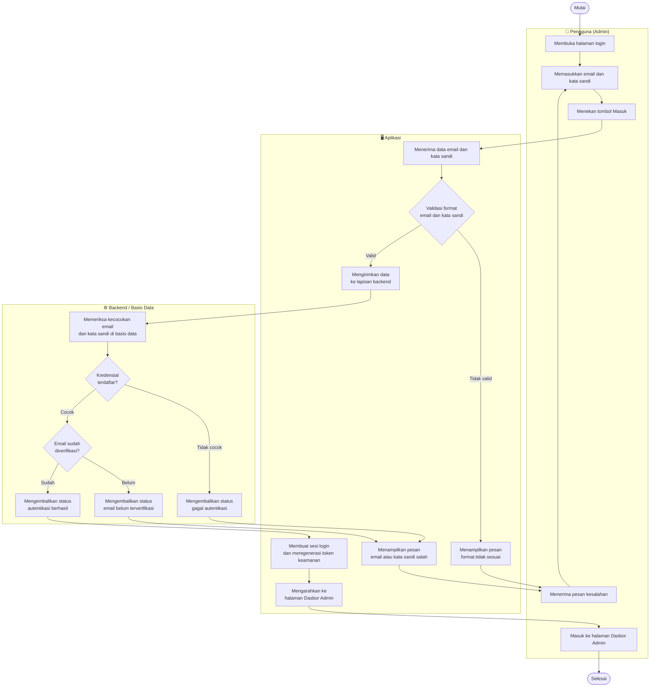
```mermaid
flowchart TD
    Mulai([Mulai]) --> A1

    subgraph Pengguna["👤 Pengguna (Admin)"]
        A1[Membuka halaman login] --> A2[Memasukkan email dan kata sandi]
        A2 --> A3[Menekan tombol Masuk]
        A9[Menerima pesan kesalahan] --> A2
        A10[Masuk ke halaman Dasbor Admin]
    end

    subgraph Aplikasi["🖥️ Aplikasi"]
        B1[Menerima data email dan kata sandi] --> B2{Validasi format\nemail dan kata sandi}
        B2 -- Tidak valid --> B3[Menampilkan pesan\nformat tidak sesuai]
        B3 --> A9
        B2 -- Valid --> B4[Mengirimkan data\nke lapisan backend]
        B7[Membuat sesi login\ndan meregenerasi token keamanan] --> B8[Mengarahkan ke\nhalaman Dasbor Admin]
        B8 --> A10
        B9[Menampilkan pesan\nemail atau kata sandi salah] --> A9
    end

    subgraph Backend["⚙️ Backend / Basis Data"]
        C1[Memeriksa kecocokan email\ndan kata sandi di basis data] --> C2{Kredensial\nterdaftar?}
        C2 -- Tidak cocok --> C3[Mengembalikan status\ngagal autentikasi]
        C3 --> B9
        C2 -- Cocok --> C4{Email sudah\ndiverifikasi?}
        C4 -- Belum --> C5[Mengembalikan status\nemail belum terverifikasi]
        C5 --> B9
        C4 -- Sudah --> C6[Mengembalikan status\nautentikasi berhasil]
        C6 --> B7
    end

    A3 --> B1
    B4 --> C1

    A10 --> Selesai([Selesai])
```

---

## 1.2 Activity Kelola Pengguna (Tambah, Edit, Hapus)

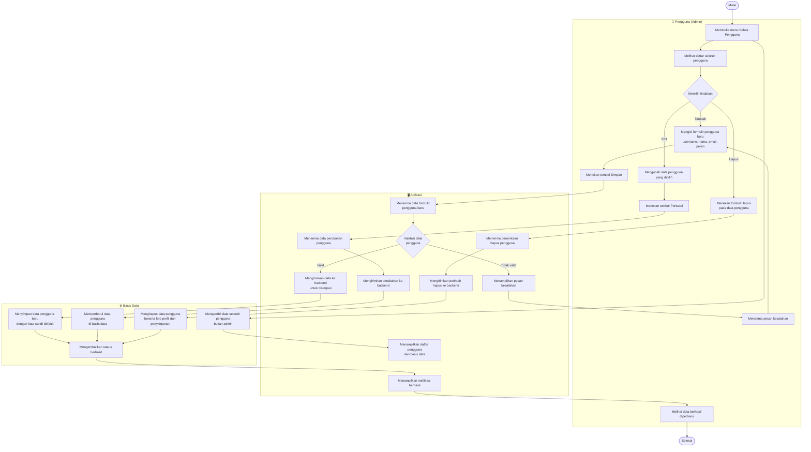
```mermaid
flowchart TD
    Mulai([Mulai]) --> A1

    subgraph Pengguna["👤 Pengguna (Admin)"]
        A1[Membuka menu Kelola Pengguna] --> A2[Melihat daftar seluruh pengguna]
        A2 --> A3{Memilih tindakan}
        A3 -- Tambah --> A4[Mengisi formulir pengguna baru\nusername, nama, email, peran]
        A4 --> A5[Menekan tombol Simpan]
        A3 -- Edit --> A6[Mengubah data pengguna yang dipilih]
        A6 --> A7[Menekan tombol Perbarui]
        A3 -- Hapus --> A8[Menekan tombol Hapus\npada data pengguna]
        A11[Menerima pesan kesalahan] --> A4
        A12[Melihat data berhasil diperbarui]
    end

    subgraph Aplikasi["🖥️ Aplikasi"]
        B1[Menampilkan daftar pengguna\ndari basis data]
        B2[Menerima data formulir\npengguna baru] --> B3{Validasi data\npengguna}
        B3 -- Tidak valid --> B4[Menampilkan pesan kesalahan]
        B4 --> A11
        B3 -- Valid --> B5[Mengirimkan data ke backend\nuntuk disimpan]
        B6[Menerima data perubahan pengguna] --> B7[Mengirimkan perubahan ke backend]
        B8[Menerima permintaan hapus pengguna] --> B9[Mengirimkan perintah hapus ke backend]
        B10[Menampilkan notifikasi berhasil] --> A12
    end

    subgraph Backend["⚙️ Basis Data"]
        C1[Mengambil data seluruh pengguna\nbukan admin] --> B1
        C2[Menyimpan data pengguna baru\ndengan kata sandi default] --> C3[Mengembalikan status berhasil]
        C4[Memperbarui data pengguna\ndi basis data] --> C3
        C5[Menghapus data pengguna\nbeserta foto profil dari penyimpanan] --> C3
        C3 --> B10
    end

    A1 --> C1
    A5 --> B2
    A7 --> B6
    A8 --> B8
    B5 --> C2
    B7 --> C4
    B9 --> C5

    A12 --> Selesai([Selesai])
```

---

## 1.3 Activity Kelola Kriteria Penilaian (Tambah, Edit, Hapus)

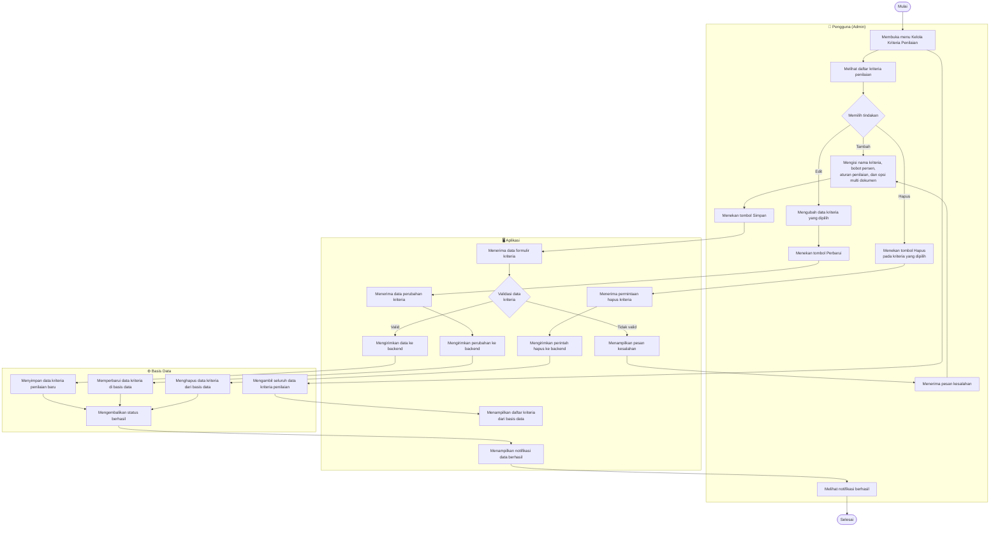
```mermaid
flowchart TD
    Mulai([Mulai]) --> A1

    subgraph Pengguna["👤 Pengguna (Admin)"]
        A1[Membuka menu Kelola Kriteria Penilaian] --> A2[Melihat daftar kriteria penilaian]
        A2 --> A3{Memilih tindakan}
        A3 -- Tambah --> A4[Mengisi nama kriteria, bobot persen,\naturan penilaian, dan opsi multi dokumen]
        A4 --> A5[Menekan tombol Simpan]
        A3 -- Edit --> A6[Mengubah data kriteria yang dipilih]
        A6 --> A7[Menekan tombol Perbarui]
        A3 -- Hapus --> A8[Menekan tombol Hapus\npada kriteria yang dipilih]
        A11[Menerima pesan kesalahan] --> A4
        A12[Melihat notifikasi berhasil]
    end

    subgraph Aplikasi["🖥️ Aplikasi"]
        B1[Menampilkan daftar kriteria\ndari basis data]
        B2[Menerima data formulir kriteria] --> B3{Validasi data\nkriteria}
        B3 -- Tidak valid --> B4[Menampilkan pesan kesalahan]
        B4 --> A11
        B3 -- Valid --> B5[Mengirimkan data ke backend]
        B6[Menerima data perubahan kriteria] --> B7[Mengirimkan perubahan ke backend]
        B8[Menerima permintaan hapus kriteria] --> B9[Mengirimkan perintah hapus ke backend]
        B10[Menampilkan notifikasi data berhasil] --> A12
    end

    subgraph Backend["⚙️ Basis Data"]
        C1[Mengambil seluruh data kriteria penilaian] --> B1
        C2[Menyimpan data kriteria penilaian baru] --> C3[Mengembalikan status berhasil]
        C4[Memperbarui data kriteria di basis data] --> C3
        C5[Menghapus data kriteria dari basis data] --> C3
        C3 --> B10
    end

    A1 --> C1
    A5 --> B2
    A7 --> B6
    A8 --> B8
    B5 --> C2
    B7 --> C4
    B9 --> C5

    A12 --> Selesai([Selesai])
```

---

## 1.4 Activity Kelola Penempatan (Tambah, Edit, Hapus)

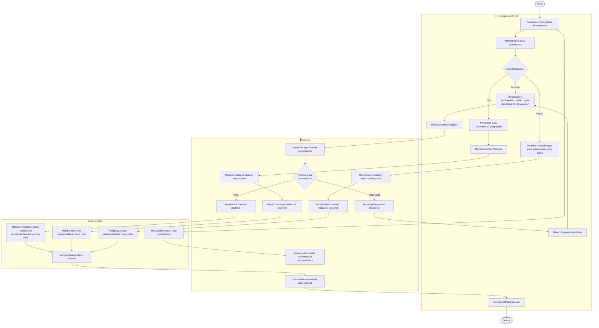
```mermaid
flowchart TD
    Mulai([Mulai]) --> A1

    subgraph Pengguna["👤 Pengguna (Admin)"]
        A1[Membuka menu Kelola Penempatan] --> A2[Melihat daftar data penempatan]
        A2 --> A3{Memilih tindakan}
        A3 -- Tambah --> A4[Mengisi nama penempatan, uraian tugas,\ndan target bobot minimum]
        A4 --> A5[Menekan tombol Simpan]
        A3 -- Edit --> A6[Mengubah data penempatan yang dipilih]
        A6 --> A7[Menekan tombol Perbarui]
        A3 -- Hapus --> A8[Menekan tombol Hapus\npada penempatan yang dipilih]
        A11[Menerima pesan kesalahan] --> A4
        A12[Melihat notifikasi berhasil]
    end

    subgraph Aplikasi["🖥️ Aplikasi"]
        B1[Menampilkan daftar penempatan\ndari basis data]
        B2[Menerima data formulir penempatan] --> B3{Validasi data\npenempatan}
        B3 -- Tidak valid --> B4[Menampilkan pesan kesalahan]
        B4 --> A11
        B3 -- Valid --> B5[Mengirimkan data ke backend]
        B6[Menerima data perubahan penempatan] --> B7[Mengirimkan perubahan ke backend]
        B8[Menerima permintaan hapus penempatan] --> B9[Mengirimkan perintah hapus ke backend]
        B10[Menampilkan notifikasi data berhasil] --> A12
    end

    subgraph Backend["⚙️ Basis Data"]
        C1[Mengambil seluruh data penempatan] --> B1
        C2[Mengonversi target bobot dari persen\nke desimal lalu menyimpan data] --> C3[Mengembalikan status berhasil]
        C4[Memperbarui data penempatan di basis data] --> C3
        C5[Menghapus data penempatan dari basis data] --> C3
        C3 --> B10
    end

    A1 --> C1
    A5 --> B2
    A7 --> B6
    A8 --> B8
    B5 --> C2
    B7 --> C4
    B9 --> C5

    A12 --> Selesai([Selesai])
```

---

## 1.5 Activity Pengaturan Sistem

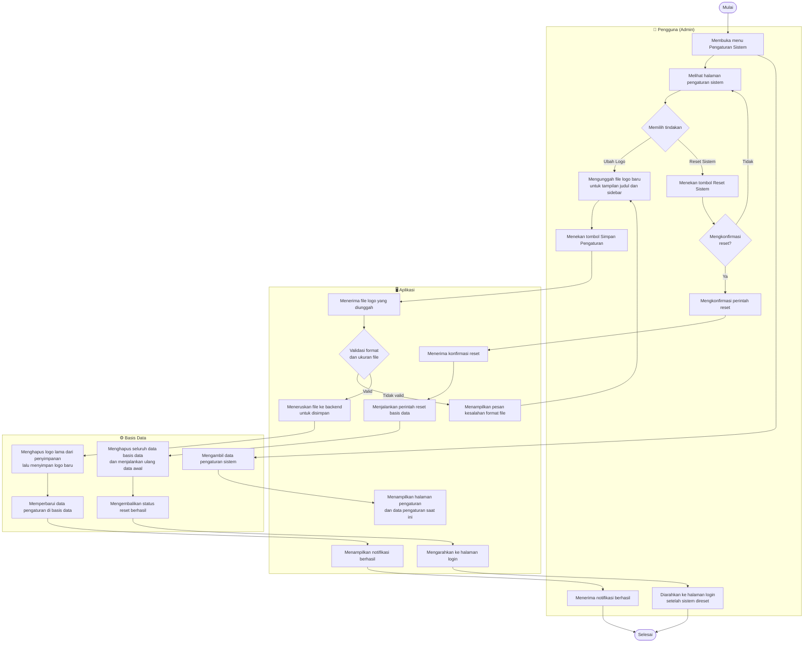
```mermaid
flowchart TD
    Mulai([Mulai]) --> A1

    subgraph Pengguna["👤 Pengguna (Admin)"]
        A1[Membuka menu Pengaturan Sistem] --> A2[Melihat halaman pengaturan sistem]
        A2 --> A3{Memilih tindakan}
        A3 -- Ubah Logo --> A4[Mengunggah file logo baru\nuntuk tampilan judul dan sidebar]
        A4 --> A5[Menekan tombol Simpan Pengaturan]
        A3 -- Reset Sistem --> A6[Menekan tombol Reset Sistem]
        A6 --> A7{Mengkonfirmasi\nreset?}
        A7 -- Tidak --> A2
        A7 -- Ya --> A8[Mengkonfirmasi perintah reset]
        A12[Menerima notifikasi berhasil]
        A13[Diarahkan ke halaman login\nsetelah sistem direset]
    end

    subgraph Aplikasi["🖥️ Aplikasi"]
        B1[Menampilkan halaman pengaturan\ndan data pengaturan saat ini]
        B2[Menerima file logo yang diunggah] --> B3{Validasi format\ndan ukuran file}
        B3 -- Tidak valid --> B4[Menampilkan pesan kesalahan format file]
        B4 --> A4
        B3 -- Valid --> B5[Meneruskan file ke backend\nuntuk disimpan]
        B6[Menerima konfirmasi reset] --> B7[Menjalankan perintah reset basis data]
        B8[Menampilkan notifikasi berhasil] --> A12
        B9[Mengarahkan ke halaman login] --> A13
    end

    subgraph Backend["⚙️ Basis Data"]
        C1[Mengambil data pengaturan sistem] --> B1
        C2[Menghapus logo lama dari penyimpanan\nlalu menyimpan logo baru] --> C3[Memperbarui data pengaturan di basis data]
        C3 --> B8
        C4[Menghapus seluruh data basis data\ndan menjalankan ulang data awal] --> C5[Mengembalikan status reset berhasil]
        C5 --> B9
    end

    A1 --> C1
    A5 --> B2
    A8 --> B6
    B5 --> C2
    B7 --> C4

    A12 --> Selesai([Selesai])
    A13 --> Selesai
```

---

## 1.6 Activity Logout Admin

```mermaid
flowchart TD
    Mulai([Mulai]) --> A1

    subgraph Pengguna["👤 Pengguna (Admin)"]
        A1[Menekan tombol Keluar\npada menu navigasi]
        A4[Diarahkan ke halaman login]
    end

    subgraph Aplikasi["🖥️ Aplikasi"]
        B1[Menerima permintaan keluar] --> B2[Menghapus informasi autentikasi\ndari sesi aktif]
        B2 --> B3[Menginvalidasi sesi\ndan meregenerasi token keamanan]
        B3 --> B4[Mengarahkan ke halaman login]
        B4 --> A4
    end

    subgraph Backend["⚙️ Basis Data"]
        C1[Menghapus data sesi pengguna\ndari penyimpanan sesi] --> C2[Mengembalikan status keluar berhasil]
        C2 --> B4
    end

    A1 --> B1
    B2 --> C1

    A4 --> Selesai([Selesai])
```

---

# 2. ACTIVITY DIAGRAM PESERTA (USER)

---

## 2.1 Activity Registrasi Akun Peserta

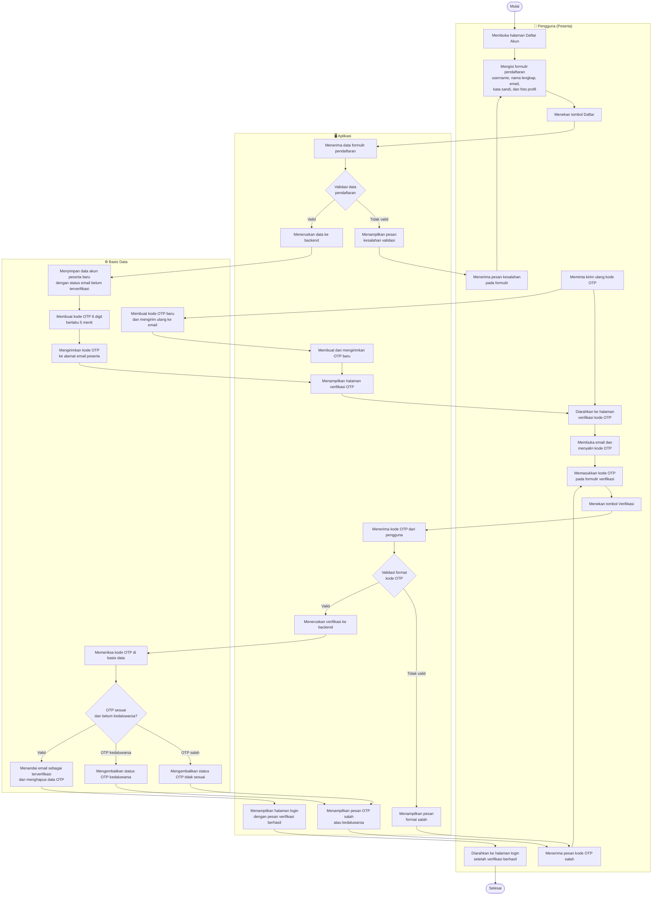
```mermaid
flowchart TD
    Mulai([Mulai]) --> A1

    subgraph Pengguna["👤 Pengguna (Peserta)"]
        A1[Membuka halaman Daftar Akun] --> A2[Mengisi formulir pendaftaran\nusername, nama lengkap, email,\nkata sandi, dan foto profil]
        A2 --> A3[Menekan tombol Daftar]
        A9[Menerima pesan kesalahan\npada formulir] --> A2
        A10[Diarahkan ke halaman\nverifikasi kode OTP]
        A10 --> A11[Membuka email dan\nmenyalin kode OTP]
        A11 --> A12[Memasukkan kode OTP\npada formulir verifikasi]
        A12 --> A13[Menekan tombol Verifikasi]
        A17[Menerima pesan kode OTP salah] --> A12
        A18[Meminta kirim ulang kode OTP]
        A18 --> A10
        A19[Diarahkan ke halaman login\nsetelah verifikasi berhasil]
    end

    subgraph Aplikasi["🖥️ Aplikasi"]
        B1[Menerima data formulir pendaftaran] --> B2{Validasi data\npendaftaran}
        B2 -- Tidak valid --> B3[Menampilkan pesan\nkesalahan validasi]
        B3 --> A9
        B2 -- Valid --> B4[Meneruskan data ke backend]
        B8[Menampilkan halaman verifikasi OTP] --> A10
        B9[Menerima kode OTP dari pengguna] --> B10{Validasi format\nkode OTP}
        B10 -- Tidak valid --> B11[Menampilkan pesan\nformat salah]
        B11 --> A17
        B10 -- Valid --> B12[Meneruskan verifikasi ke backend]
        B15[Menampilkan pesan OTP salah\natau kedaluwarsa] --> A17
        B16[Menampilkan halaman login\ndengan pesan verifikasi berhasil] --> A19
        B17[Membuat dan mengirimkan OTP baru] --> B8
    end

    subgraph Backend["⚙️ Basis Data"]
        C1[Menyimpan data akun peserta baru\ndengan status email belum terverifikasi] --> C2[Membuat kode OTP 6 digit\nberlaku 5 menit]
        C2 --> C3[Mengirimkan kode OTP\nke alamat email peserta]
        C3 --> B8
        C4[Memeriksa kode OTP di basis data] --> C5{OTP sesuai\ndan belum kedaluwarsa?}
        C5 -- OTP salah --> C6[Mengembalikan status OTP tidak sesuai]
        C6 --> B15
        C5 -- OTP kedaluwarsa --> C7[Mengembalikan status OTP kedaluwarsa]
        C7 --> B15
        C5 -- Valid --> C8[Menandai email sebagai terverifikasi\ndan menghapus data OTP]
        C8 --> B16
        C9[Membuat kode OTP baru\ndan mengirim ulang ke email] --> B17
    end

    A3 --> B1
    B4 --> C1
    A13 --> B9
    B12 --> C4
    A18 --> C9

    A19 --> Selesai([Selesai])
```

---

## 2.2 Activity Login Peserta

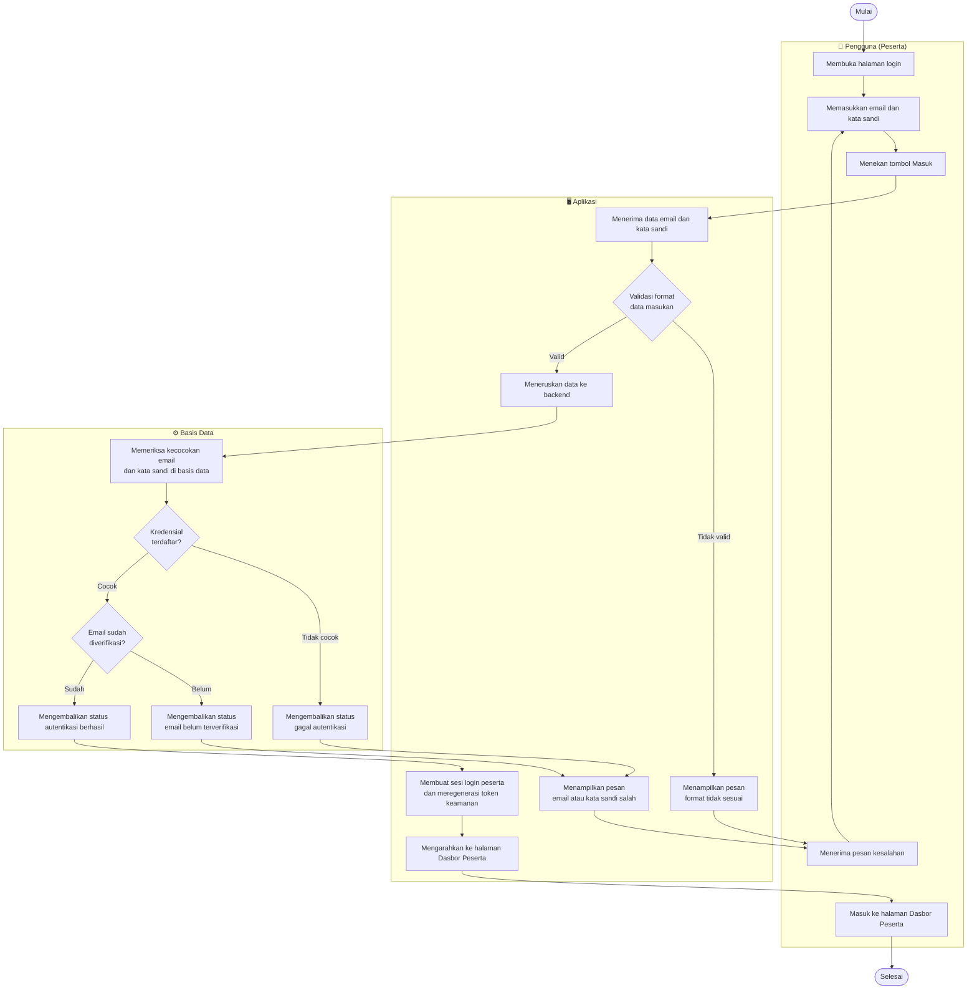
```mermaid
flowchart TD
    Mulai([Mulai]) --> A1

    subgraph Pengguna["👤 Pengguna (Peserta)"]
        A1[Membuka halaman login] --> A2[Memasukkan email dan kata sandi]
        A2 --> A3[Menekan tombol Masuk]
        A9[Menerima pesan kesalahan] --> A2
        A10[Masuk ke halaman Dasbor Peserta]
    end

    subgraph Aplikasi["🖥️ Aplikasi"]
        B1[Menerima data email dan kata sandi] --> B2{Validasi format\ndata masukan}
        B2 -- Tidak valid --> B3[Menampilkan pesan\nformat tidak sesuai]
        B3 --> A9
        B2 -- Valid --> B4[Meneruskan data ke backend]
        B7[Membuat sesi login peserta\ndan meregenerasi token keamanan] --> B8[Mengarahkan ke halaman Dasbor Peserta]
        B8 --> A10
        B9[Menampilkan pesan\nemail atau kata sandi salah] --> A9
    end

    subgraph Backend["⚙️ Basis Data"]
        C1[Memeriksa kecocokan email\ndan kata sandi di basis data] --> C2{Kredensial\nterdaftar?}
        C2 -- Tidak cocok --> C3[Mengembalikan status\ngagal autentikasi]
        C3 --> B9
        C2 -- Cocok --> C4{Email sudah\ndiverifikasi?}
        C4 -- Belum --> C5[Mengembalikan status\nemail belum terverifikasi]
        C5 --> B9
        C4 -- Sudah --> C6[Mengembalikan status autentikasi berhasil]
        C6 --> B7
    end

    A3 --> B1
    B4 --> C1

    A10 --> Selesai([Selesai])
```

---

## 2.3 Activity Unggah Berkas Penilaian

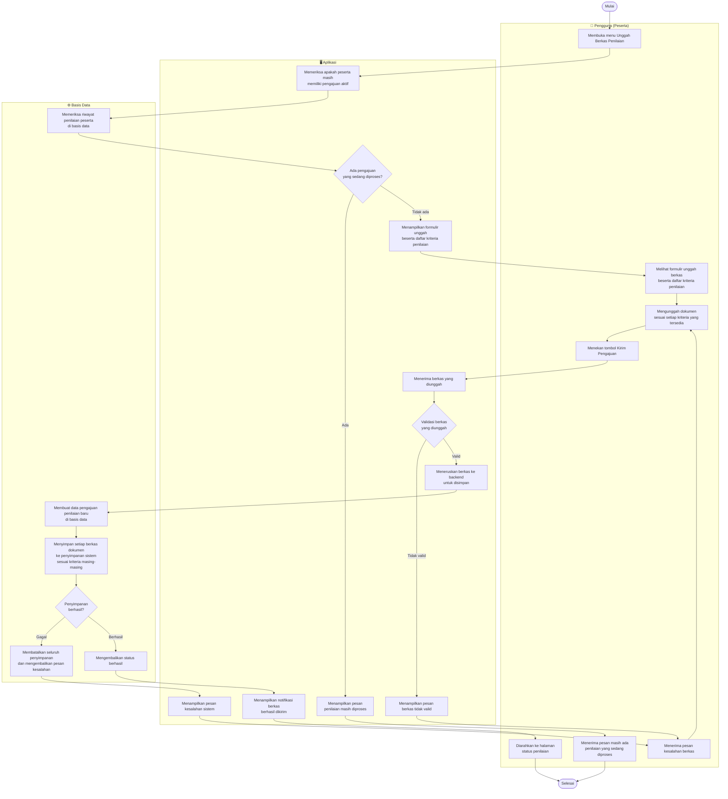
```mermaid
flowchart TD
    Mulai([Mulai]) --> A1

    subgraph Pengguna["👤 Pengguna (Peserta)"]
        A1[Membuka menu Unggah Berkas Penilaian]
        A3[Melihat formulir unggah berkas\nbeserta daftar kriteria penilaian]
        A3 --> A4[Mengunggah dokumen\nsesuai setiap kriteria yang tersedia]
        A4 --> A5[Menekan tombol Kirim Pengajuan]
        A8[Menerima pesan kesalahan berkas] --> A4
        A9[Menerima pesan masih ada\npenilaian yang sedang diproses] 
        A10[Diarahkan ke halaman\nstatus penilaian]
    end

    subgraph Aplikasi["🖥️ Aplikasi"]
        B1[Memeriksa apakah peserta masih\nmemiliki pengajuan aktif]
        B2{Ada pengajuan\nyang sedang diproses?}
        B2 -- Ada --> B3[Menampilkan pesan\npenilaian masih diproses]
        B3 --> A9
        B2 -- Tidak ada --> B4[Menampilkan formulir unggah\nbeserta daftar kriteria penilaian]
        B4 --> A3
        B5[Menerima berkas yang diunggah] --> B6{Validasi berkas\nyang diunggah}
        B6 -- Tidak valid --> B7[Menampilkan pesan berkas tidak valid]
        B7 --> A8
        B6 -- Valid --> B8[Meneruskan berkas ke backend\nuntuk disimpan]
        B11[Menampilkan notifikasi berkas\nberhasil dikirim] --> A10
        B12[Menampilkan pesan kesalahan sistem] --> A8
    end

    subgraph Backend["⚙️ Basis Data"]
        C1[Memeriksa riwayat penilaian peserta\ndi basis data] --> B2
        C2[Membuat data pengajuan penilaian baru\ndi basis data] --> C3[Menyimpan setiap berkas dokumen\nke penyimpanan sistem\nsesuai kriteria masing-masing]
        C3 --> C4{Penyimpanan\nberhasil?}
        C4 -- Gagal --> C5[Membatalkan seluruh penyimpanan\ndan mengembalikan pesan kesalahan]
        C5 --> B12
        C4 -- Berhasil --> C6[Mengembalikan status berhasil]
        C6 --> B11
    end

    A1 --> B1
    B1 --> C1
    A5 --> B5
    B8 --> C2

    A9 --> Selesai([Selesai])
    A10 --> Selesai
```

---

## 2.4 Activity Lihat Status Penilaian

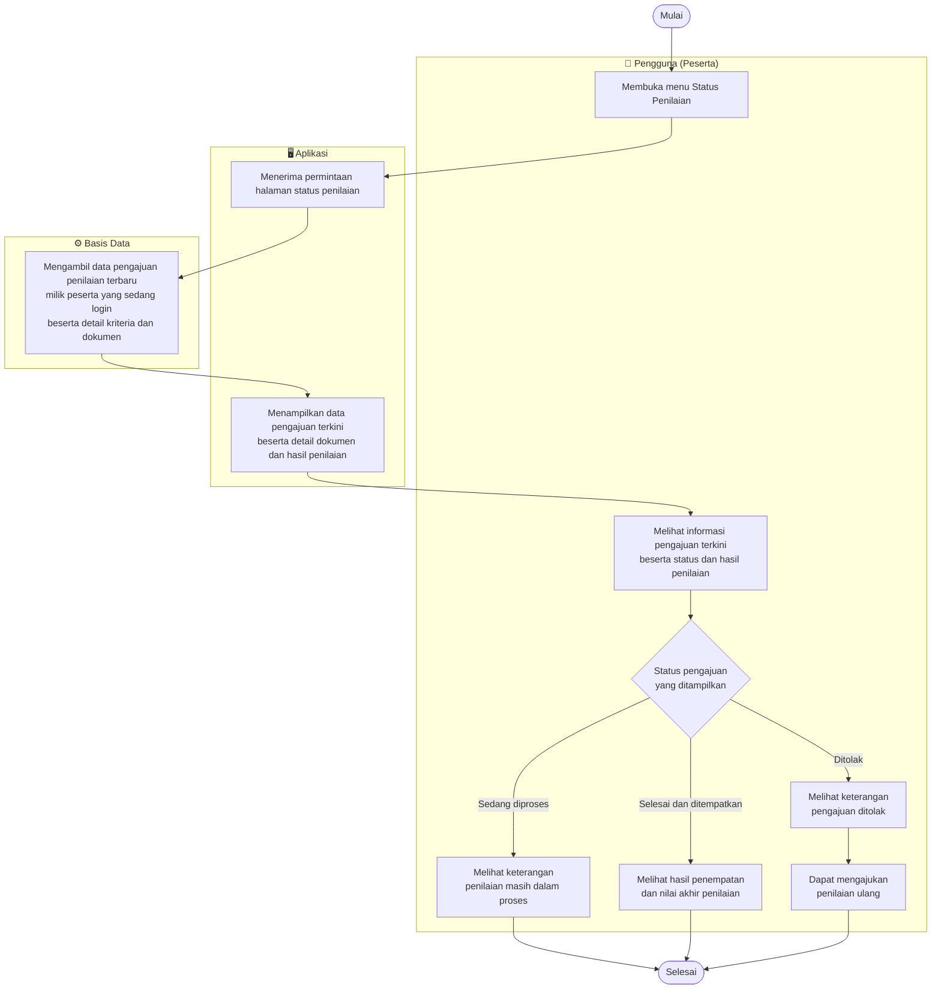
```mermaid
flowchart TD
    Mulai([Mulai]) --> A1

    subgraph Pengguna["👤 Pengguna (Peserta)"]
        A1[Membuka menu Status Penilaian]
        A4[Melihat informasi pengajuan terkini\nbeserta status dan hasil penilaian]
        A4 --> A5{Status pengajuan\nyang ditampilkan}
        A5 -- Sedang diproses --> A6[Melihat keterangan\npenilaian masih dalam proses]
        A5 -- Selesai dan ditempatkan --> A7[Melihat hasil penempatan\ndan nilai akhir penilaian]
        A5 -- Ditolak --> A8[Melihat keterangan\npengajuan ditolak]
        A8 --> A9[Dapat mengajukan\npenilaian ulang]
    end

    subgraph Aplikasi["🖥️ Aplikasi"]
        B1[Menerima permintaan halaman status penilaian]
        B2[Menampilkan data pengajuan terkini\nbeserta detail dokumen dan hasil penilaian]
        B2 --> A4
    end

    subgraph Backend["⚙️ Basis Data"]
        C1[Mengambil data pengajuan penilaian terbaru\nmilik peserta yang sedang login\nbeserta detail kriteria dan dokumen] --> B2
    end

    A1 --> B1
    B1 --> C1

    A6 --> Selesai([Selesai])
    A7 --> Selesai
    A9 --> Selesai
```

---

## 2.5 Activity Riwayat Penilaian

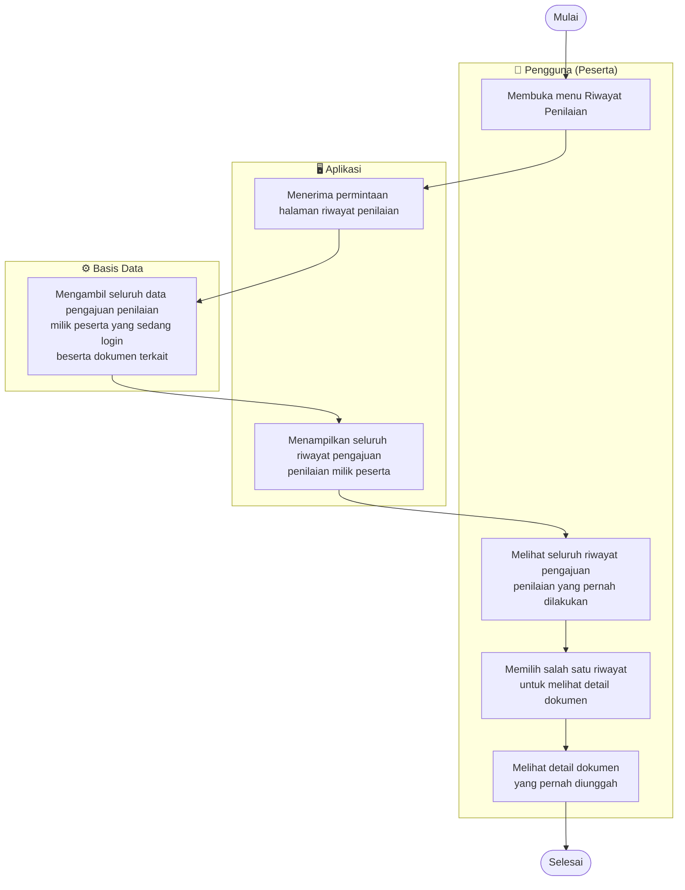
```mermaid
flowchart TD
    Mulai([Mulai]) --> A1

    subgraph Pengguna["👤 Pengguna (Peserta)"]
        A1[Membuka menu Riwayat Penilaian]
        A4[Melihat seluruh riwayat pengajuan\npenilaian yang pernah dilakukan]
        A4 --> A5[Memilih salah satu riwayat\nuntuk melihat detail dokumen]
        A5 --> A6[Melihat detail dokumen\nyang pernah diunggah]
    end

    subgraph Aplikasi["🖥️ Aplikasi"]
        B1[Menerima permintaan halaman riwayat penilaian]
        B2[Menampilkan seluruh riwayat pengajuan\npenilaian milik peserta]
        B2 --> A4
    end

    subgraph Backend["⚙️ Basis Data"]
        C1[Mengambil seluruh data pengajuan penilaian\nmilik peserta yang sedang login\nbeserta dokumen terkait] --> B2
    end

    A1 --> B1
    B1 --> C1

    A6 --> Selesai([Selesai])
```

---

## 2.6 Activity Kelola Profil Peserta

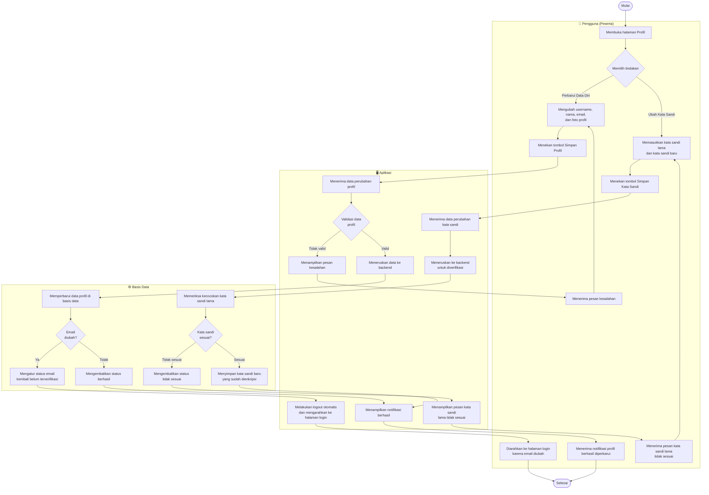
```mermaid
flowchart TD
    Mulai([Mulai]) --> A1

    subgraph Pengguna["👤 Pengguna (Peserta)"]
        A1[Membuka halaman Profil] --> A2{Memilih tindakan}
        A2 -- Perbarui Data Diri --> A3[Mengubah username, nama, email,\ndan foto profil]
        A3 --> A4[Menekan tombol Simpan Profil]
        A2 -- Ubah Kata Sandi --> A5[Memasukkan kata sandi lama\ndan kata sandi baru]
        A5 --> A6[Menekan tombol Simpan Kata Sandi]
        A10[Menerima pesan kesalahan] --> A3
        A11[Menerima pesan kata sandi lama\ntidak sesuai] --> A5
        A12[Menerima notifikasi profil berhasil diperbarui]
        A13[Diarahkan ke halaman login\nkarena email diubah]
    end

    subgraph Aplikasi["🖥️ Aplikasi"]
        B1[Menerima data perubahan profil] --> B2{Validasi data\nprofil}
        B2 -- Tidak valid --> B3[Menampilkan pesan kesalahan]
        B3 --> A10
        B2 -- Valid --> B4[Meneruskan data ke backend]
        B5[Menerima data perubahan kata sandi] --> B6[Meneruskan ke backend\nuntuk diverifikasi]
        B9[Menampilkan notifikasi berhasil] --> A12
        B10[Melakukan logout otomatis\ndan mengarahkan ke halaman login] --> A13
        B11[Menampilkan pesan kata sandi\nlama tidak sesuai] --> A11
    end

    subgraph Backend["⚙️ Basis Data"]
        C1[Memperbarui data profil di basis data] --> C2{Email\ndiubah?}
        C2 -- Ya --> C3[Mengatur status email\nkembali belum terverifikasi]
        C3 --> B10
        C2 -- Tidak --> C4[Mengembalikan status berhasil]
        C4 --> B9
        C5[Memeriksa kecocokan kata sandi lama] --> C6{Kata sandi\nsesuai?}
        C6 -- Tidak sesuai --> C7[Mengembalikan status tidak sesuai]
        C7 --> B11
        C6 -- Sesuai --> C8[Menyimpan kata sandi baru\nyang sudah dienkripsi]
        C8 --> B9
    end

    A4 --> B1
    B4 --> C1
    A6 --> B5
    B6 --> C5

    A12 --> Selesai([Selesai])
    A13 --> Selesai
```

---

## 2.7 Activity Logout Peserta

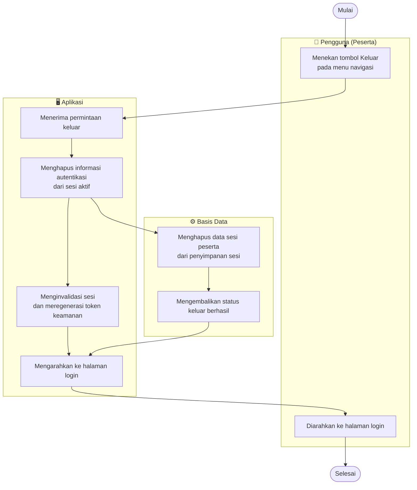
```mermaid
flowchart TD
    Mulai([Mulai]) --> A1

    subgraph Pengguna["👤 Pengguna (Peserta)"]
        A1[Menekan tombol Keluar\npada menu navigasi]
        A4[Diarahkan ke halaman login]
    end

    subgraph Aplikasi["🖥️ Aplikasi"]
        B1[Menerima permintaan keluar] --> B2[Menghapus informasi autentikasi\ndari sesi aktif]
        B2 --> B3[Menginvalidasi sesi\ndan meregenerasi token keamanan]
        B3 --> B4[Mengarahkan ke halaman login]
        B4 --> A4
    end

    subgraph Backend["⚙️ Basis Data"]
        C1[Menghapus data sesi peserta\ndari penyimpanan sesi] --> C2[Mengembalikan status keluar berhasil]
        C2 --> B4
    end

    A1 --> B1
    B2 --> C1

    A4 --> Selesai([Selesai])
```

---

# 3. ACTIVITY DIAGRAM PENANGGUNG JAWAB

---

## 3.1 Activity Login Penanggung Jawab

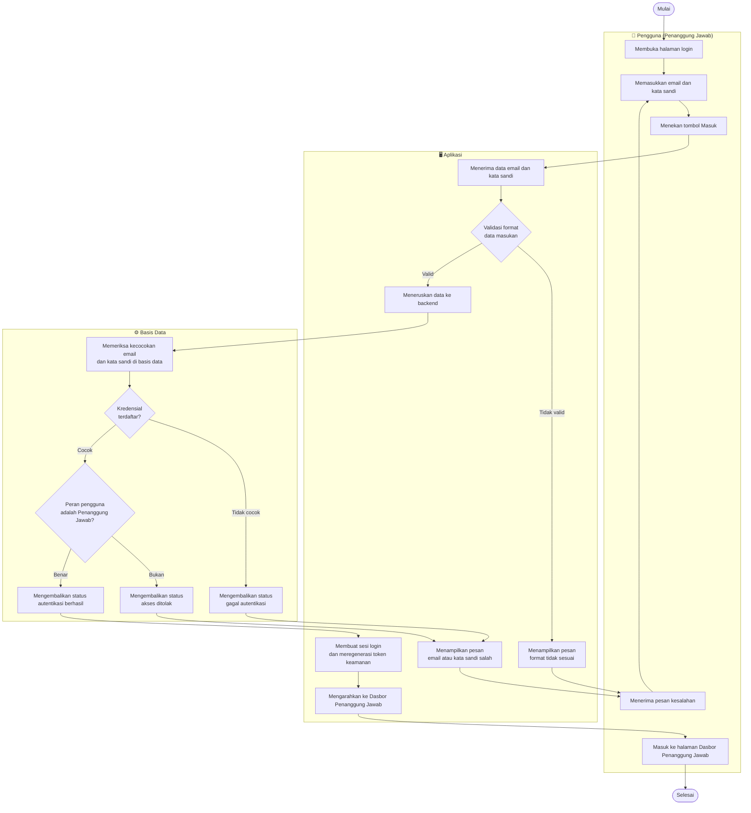
```mermaid
flowchart TD
    Mulai([Mulai]) --> A1

    subgraph Pengguna["👤 Pengguna (Penanggung Jawab)"]
        A1[Membuka halaman login] --> A2[Memasukkan email dan kata sandi]
        A2 --> A3[Menekan tombol Masuk]
        A9[Menerima pesan kesalahan] --> A2
        A10[Masuk ke halaman Dasbor Penanggung Jawab]
    end

    subgraph Aplikasi["🖥️ Aplikasi"]
        B1[Menerima data email dan kata sandi] --> B2{Validasi format\ndata masukan}
        B2 -- Tidak valid --> B3[Menampilkan pesan\nformat tidak sesuai]
        B3 --> A9
        B2 -- Valid --> B4[Meneruskan data ke backend]
        B7[Membuat sesi login\ndan meregenerasi token keamanan] --> B8[Mengarahkan ke Dasbor Penanggung Jawab]
        B8 --> A10
        B9[Menampilkan pesan\nemail atau kata sandi salah] --> A9
    end

    subgraph Backend["⚙️ Basis Data"]
        C1[Memeriksa kecocokan email\ndan kata sandi di basis data] --> C2{Kredensial\nterdaftar?}
        C2 -- Tidak cocok --> C3[Mengembalikan status\ngagal autentikasi]
        C3 --> B9
        C2 -- Cocok --> C4{Peran pengguna\nadalah Penanggung Jawab?}
        C4 -- Bukan --> C5[Mengembalikan status\nakses ditolak]
        C5 --> B9
        C4 -- Benar --> C6[Mengembalikan status autentikasi berhasil]
        C6 --> B7
    end

    A3 --> B1
    B4 --> C1

    A10 --> Selesai([Selesai])
```

---

## 3.2 Activity Proses Penilaian Otomatis dengan Kecerdasan Buatan

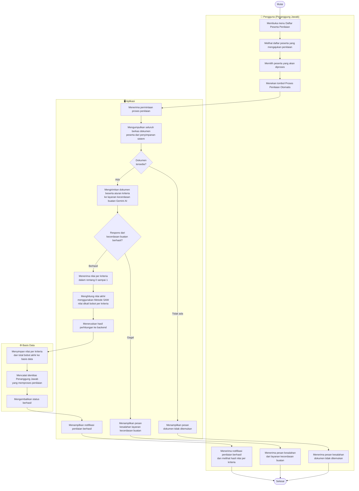
```mermaid
flowchart TD
    Mulai([Mulai]) --> A1

    subgraph Pengguna["👤 Pengguna (Penanggung Jawab)"]
        A1[Membuka menu Daftar Peserta Penilaian] --> A2[Melihat daftar peserta yang mengajukan penilaian]
        A2 --> A3[Memilih peserta yang akan diproses]
        A3 --> A4[Menekan tombol Proses Penilaian Otomatis]
        A10[Menerima pesan kesalahan\ndokumen tidak ditemukan] 
        A11[Menerima notifikasi penilaian berhasil\ndan melihat hasil nilai per kriteria]
        A12[Menerima pesan kesalahan\ndari layanan kecerdasan buatan]
    end

    subgraph Aplikasi["🖥️ Aplikasi"]
        B1[Menerima permintaan proses penilaian] --> B2[Mengumpulkan seluruh berkas dokumen\npeserta dari penyimpanan sistem]
        B2 --> B3{Dokumen\ntersedia?}
        B3 -- Tidak ada --> B4[Menampilkan pesan\ndokumen tidak ditemukan]
        B4 --> A10
        B3 -- Ada --> B5[Mengirimkan dokumen beserta aturan kriteria\nke layanan kecerdasan buatan Gemini AI]
        B5 --> B6{Respons dari\nkecerdasan buatan berhasil?}
        B6 -- Gagal --> B7[Menampilkan pesan\nkesalahan layanan kecerdasan buatan]
        B7 --> A12
        B6 -- Berhasil --> B8[Menerima nilai per kriteria\ndalam rentang 0 sampai 1]
        B8 --> B9[Menghitung nilai akhir\nmenggunakan Metode SAW\nnilai dikali bobot per kriteria]
        B9 --> B10[Meneruskan hasil perhitungan ke backend]
        B11[Menampilkan notifikasi penilaian berhasil] --> A11
    end

    subgraph Backend["⚙️ Basis Data"]
        C1[Menyimpan nilai per kriteria\ndan total bobot akhir ke basis data] --> C2[Mencatat identitas Penanggung Jawab\nyang memproses penilaian]
        C2 --> C3[Mengembalikan status berhasil]
        C3 --> B11
    end

    A4 --> B1
    B10 --> C1

    A10 --> Selesai([Selesai])
    A11 --> Selesai
    A12 --> Selesai
```

---

## 3.3 Activity Tetapkan Penempatan Peserta

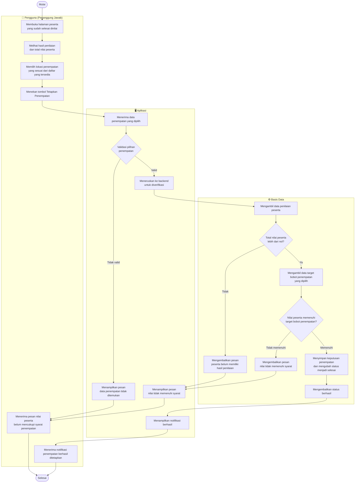
```mermaid
flowchart TD
    Mulai([Mulai]) --> A1

    subgraph Pengguna["👤 Pengguna (Penanggung Jawab)"]
        A1[Membuka halaman peserta\nyang sudah selesai dinilai] --> A2[Melihat hasil penilaian\ndan total nilai peserta]
        A2 --> A3[Memilih lokasi penempatan\nyang sesuai dari daftar yang tersedia]
        A3 --> A4[Menekan tombol Tetapkan Penempatan]
        A9[Menerima pesan nilai peserta\nbelum mencukupi syarat penempatan]
        A10[Menerima notifikasi penempatan berhasil ditetapkan]
    end

    subgraph Aplikasi["🖥️ Aplikasi"]
        B1[Menerima data penempatan yang dipilih] --> B2{Validasi pilihan\npenempatan}
        B2 -- Tidak valid --> B3[Menampilkan pesan\ndata penempatan tidak ditemukan]
        B3 --> A9
        B2 -- Valid --> B4[Meneruskan ke backend\nuntuk diverifikasi]
        B8[Menampilkan pesan\nnilai tidak memenuhi syarat] --> A9
        B9[Menampilkan notifikasi berhasil] --> A10
    end

    subgraph Backend["⚙️ Basis Data"]
        C1[Mengambil data penilaian peserta] --> C2{Total nilai peserta\nlebih dari nol?}
        C2 -- Tidak --> C3[Mengembalikan pesan\npeserta belum memiliki hasil penilaian]
        C3 --> B8
        C2 -- Ya --> C4[Mengambil data target bobot penempatan\nyang dipilih]
        C4 --> C5{Nilai peserta memenuhi\ntarget bobot penempatan?}
        C5 -- Tidak memenuhi --> C6[Mengembalikan pesan\nnilai tidak memenuhi syarat]
        C6 --> B8
        C5 -- Memenuhi --> C7[Menyimpan keputusan penempatan\ndan mengubah status menjadi selesai]
        C7 --> C8[Mengembalikan status berhasil]
        C8 --> B9
    end

    A4 --> B1
    B4 --> C1

    A9 --> Selesai([Selesai])
    A10 --> Selesai
```

---

## 3.4 Activity Tolak Peserta Penilaian

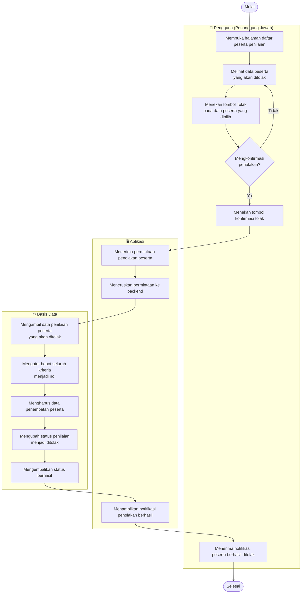
```mermaid
flowchart TD
    Mulai([Mulai]) --> A1

    subgraph Pengguna["👤 Pengguna (Penanggung Jawab)"]
        A1[Membuka halaman daftar peserta penilaian] --> A2[Melihat data peserta\nyang akan ditolak]
        A2 --> A3[Menekan tombol Tolak\npada data peserta yang dipilih]
        A3 --> A4{Mengkonfirmasi\npenolakan?}
        A4 -- Tidak --> A2
        A4 -- Ya --> A5[Menekan tombol konfirmasi tolak]
        A9[Menerima notifikasi peserta berhasil ditolak]
    end

    subgraph Aplikasi["🖥️ Aplikasi"]
        B1[Menerima permintaan penolakan peserta] --> B2[Meneruskan permintaan ke backend]
        B5[Menampilkan notifikasi penolakan berhasil] --> A9
    end

    subgraph Backend["⚙️ Basis Data"]
        C1[Mengambil data penilaian peserta\nyang akan ditolak] --> C2[Mengatur bobot seluruh kriteria\nmenjadi nol]
        C2 --> C3[Menghapus data penempatan peserta]
        C3 --> C4[Mengubah status penilaian\nmenjadi ditolak]
        C4 --> C5[Mengembalikan status berhasil]
        C5 --> B5
    end

    A5 --> B1
    B2 --> C1

    A9 --> Selesai([Selesai])
```

---

## 3.5 Activity Perbarui Bobot Penilaian secara Manual

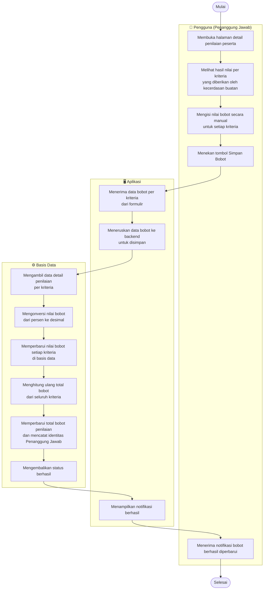
```mermaid
flowchart TD
    Mulai([Mulai]) --> A1

    subgraph Pengguna["👤 Pengguna (Penanggung Jawab)"]
        A1[Membuka halaman detail penilaian peserta] --> A2[Melihat hasil nilai per kriteria\nyang diberikan oleh kecerdasan buatan]
        A2 --> A3[Mengisi nilai bobot secara manual\nuntuk setiap kriteria]
        A3 --> A4[Menekan tombol Simpan Bobot]
        A9[Menerima notifikasi bobot berhasil diperbarui]
    end

    subgraph Aplikasi["🖥️ Aplikasi"]
        B1[Menerima data bobot per kriteria\ndari formulir] --> B2[Meneruskan data bobot ke backend\nuntuk disimpan]
        B6[Menampilkan notifikasi berhasil] --> A9
    end

    subgraph Backend["⚙️ Basis Data"]
        C1[Mengambil data detail penilaian\nper kriteria] --> C2[Mengonversi nilai bobot\ndari persen ke desimal]
        C2 --> C3[Memperbarui nilai bobot setiap kriteria\ndi basis data]
        C3 --> C4[Menghitung ulang total bobot\ndari seluruh kriteria]
        C4 --> C5[Memperbarui total bobot penilaian\ndan mencatat identitas Penanggung Jawab]
        C5 --> C6[Mengembalikan status berhasil]
        C6 --> B6
    end

    A4 --> B1
    B2 --> C1

    A9 --> Selesai([Selesai])
```

---

## 3.6 Activity Logout Penanggung Jawab

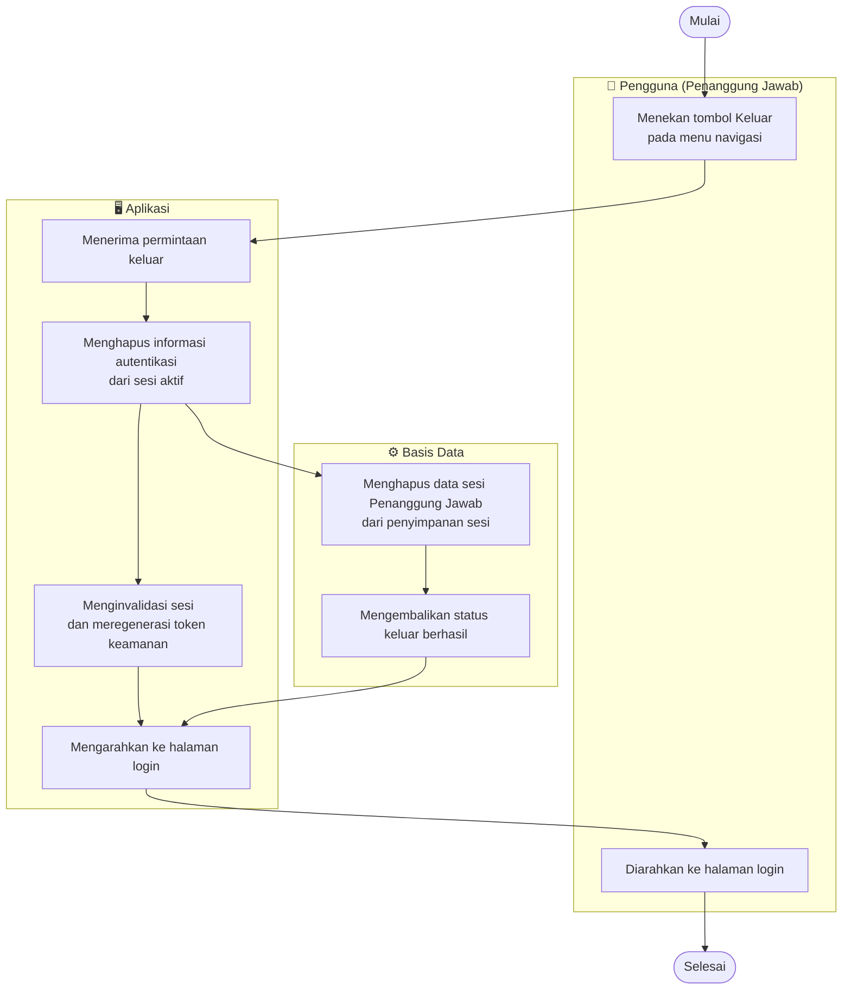
```mermaid
flowchart TD
    Mulai([Mulai]) --> A1

    subgraph Pengguna["👤 Pengguna (Penanggung Jawab)"]
        A1[Menekan tombol Keluar\npada menu navigasi]
        A4[Diarahkan ke halaman login]
    end

    subgraph Aplikasi["🖥️ Aplikasi"]
        B1[Menerima permintaan keluar] --> B2[Menghapus informasi autentikasi\ndari sesi aktif]
        B2 --> B3[Menginvalidasi sesi\ndan meregenerasi token keamanan]
        B3 --> B4[Mengarahkan ke halaman login]
        B4 --> A4
    end

    subgraph Backend["⚙️ Basis Data"]
        C1[Menghapus data sesi Penanggung Jawab\ndari penyimpanan sesi] --> C2[Mengembalikan status keluar berhasil]
        C2 --> B4
    end

    A1 --> B1
    B2 --> C1

    A4 --> Selesai([Selesai])
```

---

## Daftar Seluruh Activity Diagram

| No | Kelompok | Nama Activity |
|---|---|---|
| **1.1** | Admin | Login Admin |
| **1.2** | Admin | Kelola Pengguna (Tambah, Edit, Hapus) |
| **1.3** | Admin | Kelola Kriteria Penilaian (Tambah, Edit, Hapus) |
| **1.4** | Admin | Kelola Penempatan (Tambah, Edit, Hapus) |
| **1.5** | Admin | Pengaturan Sistem (Logo & Reset) |
| **1.6** | Admin | Logout Admin |
| **2.1** | Peserta | Registrasi Akun dan Verifikasi OTP |
| **2.2** | Peserta | Login Peserta |
| **2.3** | Peserta | Unggah Berkas Penilaian |
| **2.4** | Peserta | Lihat Status Penilaian |
| **2.5** | Peserta | Riwayat Penilaian |
| **2.6** | Peserta | Kelola Profil Peserta |
| **2.7** | Peserta | Logout Peserta |
| **3.1** | Penanggung Jawab | Login Penanggung Jawab |
| **3.2** | Penanggung Jawab | Proses Penilaian Otomatis (AI + SAW) |
| **3.3** | Penanggung Jawab | Tetapkan Penempatan Peserta |
| **3.4** | Penanggung Jawab | Tolak Peserta Penilaian |
| **3.5** | Penanggung Jawab | Perbarui Bobot Penilaian Manual |
| **3.6** | Penanggung Jawab | Logout Penanggung Jawab |
