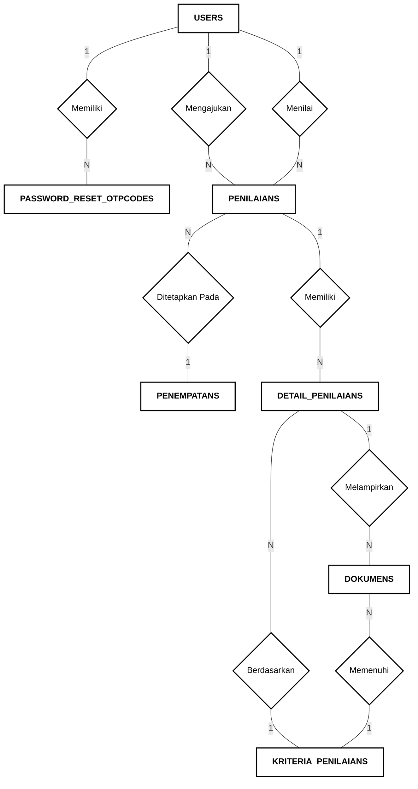

# ENTITY RELATIONSHIP DIAGRAM (ERD) — NOTASI CHEN (MONOKROM)
## Sistem Informasi Penilaian (SIPENA)

> **Standar Notasi Chen (Peter Chen) — Format Akademik Hitam & Putih**:
> - 🔲 **Entitas (*Entity*)** : Kotak Persegi Panjang `[ Nama Entitas ]`
> - ⬨ **Relasi (*Relationship*)** : Belah Ketupat `{ Nama Relasi }`
> - ⬭ **Atribut (*Attribute*)** : Elips / Oval `( Nama Atribut )`
> - <u>Key</u> **Primary Key (PK)** : Teks bergaris bawah `( <u>id</u> )`
> - 🔗 **Kardinalitas** : Penanda rasio `1` atau `N` pada garis penghubung

---

## 1. Diagram Utama: Relasi Antar Entitas (Notasi Chen Monokrom)

Diagram ini menggambarkan hubungan struktural antar entitas berdasarkan tabel basis data SIPENA tanpa warna:

---

## 2. Diagram Rinci: Entitas Beserta Seluruh Atribut Sesuai Database

Berikut adalah rincian seluruh atribut per tabel database SIPENA:

```mermaid
flowchart TB
    %% Monochrome Class Definitions
    classDef entitas fill:#ffffff,stroke:#000000,stroke-width:2px,color:#000000,font-weight:bold;
    classDef relasi fill:#ffffff,stroke:#000000,stroke-width:1.8px,color:#000000;
    classDef atribut fill:#ffffff,stroke:#000000,stroke-width:1.2px,color:#000000;

    %% ----------------------------------------------------
    %% 1. TABEL USERS
    %% ----------------------------------------------------
    T_USERS["USERS"]:::entitas
    U_id(["<u>id</u>"]):::atribut
    U_username(["username"]):::atribut
    U_nama(["nama_lengkap"]):::atribut
    U_email(["email"]):::atribut
    U_password(["password"]):::atribut
    U_role(["role"]):::atribut
    U_foto(["foto_profil"]):::atribut
    U_verif(["email_verified_at"]):::atribut

    T_USERS --- U_id
    T_USERS --- U_username
    T_USERS --- U_nama
    T_USERS --- U_email
    T_USERS --- U_password
    T_USERS --- U_role
    T_USERS --- U_foto
    T_USERS --- U_verif

    %% ----------------------------------------------------
    %% 2. TABEL PASSWORD_RESET_OTPCODES
    %% ----------------------------------------------------
    T_OTP["PASSWORD_RESET_OTPCODES"]:::entitas
    OTP_id(["<u>id</u>"]):::atribut
    OTP_email(["email"]):::atribut
    OTP_otp(["otpcode"]):::atribut
    OTP_exp(["expired_at"]):::atribut

    T_OTP --- OTP_id
    T_OTP --- OTP_email
    T_OTP --- OTP_otp
    T_OTP --- OTP_exp

    %% ----------------------------------------------------
    %% 3. TABEL PENILAIANS
    %% ----------------------------------------------------
    T_PENILAIANS["PENILAIANS"]:::entitas
    P_id(["<u>id</u>"]):::atribut
    P_user(["user_id"]):::atribut
    P_pj(["penanggungjawab_id"]):::atribut
    P_penempatan(["penempatan_id"]):::atribut
    P_bobot(["total_bobot"]):::atribut
    P_flag(["flag_penilaian"]):::atribut

    T_PENILAIANS --- P_id
    T_PENILAIANS --- P_user
    T_PENILAIANS --- P_pj
    T_PENILAIANS --- P_penempatan
    T_PENILAIANS --- P_bobot
    T_PENILAIANS --- P_flag

    %% ----------------------------------------------------
    %% 4. TABEL PENEMPATANS
    %% ----------------------------------------------------
    T_PENEMPATANS["PENEMPATANS"]:::entitas
    PN_id(["<u>id</u>"]):::atribut
    PN_nama(["nama_penempatan"]):::atribut
    PN_target(["target_bobot"]):::atribut
    PN_tugas(["tugas"]):::atribut

    T_PENEMPATANS --- PN_id
    T_PENEMPATANS --- PN_nama
    T_PENEMPATANS --- PN_target
    T_PENEMPATANS --- PN_tugas

    %% ----------------------------------------------------
    %% 5. TABEL KRITERIA_PENILAIANS
    %% ----------------------------------------------------
    T_KRITERIA["KRITERIA_PENILAIANS"]:::entitas
    K_id(["<u>id</u>"]):::atribut
    K_nama(["nama_kriteria"]):::atribut
    K_bobot(["bobot"]):::atribut
    K_aturan(["aturan"]):::atribut
    K_multi(["multi_dokumen"]):::atribut

    T_KRITERIA --- K_id
    T_KRITERIA --- K_nama
    T_KRITERIA --- K_bobot
    T_KRITERIA --- K_aturan
    T_KRITERIA --- K_multi

    %% ----------------------------------------------------
    %% 6. TABEL DETAIL_PENILAIANS
    %% ----------------------------------------------------
    T_DETAIL["DETAIL_PENILAIANS"]:::entitas
    DP_id(["<u>id</u>"]):::atribut
    DP_penilaian(["penilaian_id"]):::atribut
    DP_kriteria(["kriteria_id"]):::atribut
    DP_bobot(["bobot"]):::atribut
    DP_bahan(["bahan_penilaian"]):::atribut

    T_DETAIL --- DP_id
    T_DETAIL --- DP_penilaian
    T_DETAIL --- DP_kriteria
    T_DETAIL --- DP_bobot
    T_DETAIL --- DP_bahan

    %% ----------------------------------------------------
    %% 7. TABEL DOKUMENS
    %% ----------------------------------------------------
    T_DOKUMENS["DOKUMENS"]:::entitas
    D_id(["<u>id</u>"]):::atribut
    D_detail(["detailpenilaian_id"]):::atribut
    D_kriteria(["kriteria_id"]):::atribut
    D_dokumen(["dokumen"]):::atribut

    T_DOKUMENS --- D_id
    T_DOKUMENS --- D_detail
    T_DOKUMENS --- D_kriteria
    T_DOKUMENS --- D_dokumen

    %% ----------------------------------------------------
    %% RELASI ANTAR ENTITAS
    %% ----------------------------------------------------
    R1{"Memiliki"}:::relasi
    R2{"Mengajukan"}:::relasi
    R3{"Menilai"}:::relasi
    R4{"Ditetapkan"}:::relasi
    R5{"Memiliki"}:::relasi
    R6{"Berdasarkan"}:::relasi
    R7{"Melampirkan"}:::relasi
    R8{"Memenuhi"}:::relasi

    T_USERS ---|1| R1 ---|N| T_OTP
    T_USERS ---|1| R2 ---|N| T_PENILAIANS
    T_USERS ---|1| R3 ---|N| T_PENILAIANS
    T_PENILAIANS ---|N| R4 ---|1| T_PENEMPATANS
    T_PENILAIANS ---|1| R5 ---|N| T_DETAIL
    T_DETAIL ---|N| R6 ---|1| T_KRITERIA
    T_DETAIL ---|1| R7 ---|N| T_DOKUMENS
    T_DOKUMENS ---|N| R8 ---|1| T_KRITERIA
```

---

## 3. Kamus Data & Relasi Database SIPENA (Tabel Akademik)

| Nama Tabel | Primary Key (PK) | Foreign Key (FK) | Kolom Atribut Lainnya | Relasi & Kardinalitas |
| :--- | :--- | :--- | :--- | :--- |
| **users** | `id` | - | `username`, `nama_lengkap`, `email`, `password`, `role`, `foto_profil`, `email_verified_at` | `1 : N` ke `penilaians` (pengaju), `1 : N` ke `penilaians` (penilai), `1 : N` ke `password_reset_otpcodes` |
| **password_reset_otpcodes** | `id` | - | `email`, `otpcode`, `expired_at` | `N : 1` ke `users` (via email) |
| **penilaians** | `id` | `user_id`, `penanggungjawab_id`, `penempatan_id` | `total_bobot`, `flag_penilaian` | `N : 1` ke `users`, `N : 1` ke `penempatans`, `1 : N` ke `detail_penilaians` |
| **penempatans** | `id` | - | `nama_penempatan`, `target_bobot`, `tugas` | `1 : N` ke `penilaians` |
| **kriteria_penilaians** | `id` | - | `nama_kriteria`, `bobot`, `aturan`, `multi_dokumen` | `1 : N` ke `detail_penilaians`, `1 : N` ke `dokumens` |
| **detail_penilaians** | `id` | `penilaian_id`, `kriteria_id` | `bobot`, `bahan_penilaian` | `N : 1` ke `penilaians`, `N : 1` ke `kriteria_penilaians`, `1 : N` ke `dokumens` |
| **dokumens** | `id` | `detailpenilaian_id`, `kriteria_id` | `dokumen` | `N : 1` ke `detail_penilaians`, `N : 1` ke `kriteria_penilaians` |
| **pengaturan_sistems** | `id` | - | `nama_pengaturan`, `value` | Tabel konfigurasi independen sistem |
