# SEQUENCE DIAGRAM SISTEM INFORMASI PENILAIAN (SIPENA)

> **Format Partisipan**: `Pengguna → Aplikasi → Controller → Database`

---

# 1. SEQUENCE DIAGRAM ADMIN

---

## 1.1 Sequence Login dan Logout Admin

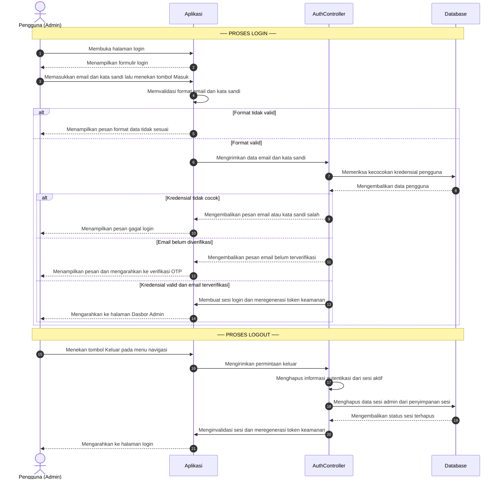
```mermaid
sequenceDiagram
    autonumber
    actor Pengguna as Pengguna (Admin)
    participant Aplikasi as Aplikasi
    participant Controller as AuthController
    participant Database as Database

    Note over Pengguna, Database: ── PROSES LOGIN ──

    Pengguna->>Aplikasi: Membuka halaman login
    Aplikasi-->>Pengguna: Menampilkan formulir login

    Pengguna->>Aplikasi: Memasukkan email dan kata sandi lalu menekan tombol Masuk
    Aplikasi->>Aplikasi: Memvalidasi format email dan kata sandi

    alt Format tidak valid
        Aplikasi-->>Pengguna: Menampilkan pesan format data tidak sesuai
    else Format valid
        Aplikasi->>Controller: Mengirimkan data email dan kata sandi
        Controller->>Database: Memeriksa kecocokan kredensial pengguna
        Database-->>Controller: Mengembalikan data pengguna

        alt Kredensial tidak cocok
            Controller-->>Aplikasi: Mengembalikan pesan email atau kata sandi salah
            Aplikasi-->>Pengguna: Menampilkan pesan gagal login
        else Email belum diverifikasi
            Controller-->>Aplikasi: Mengembalikan pesan email belum terverifikasi
            Aplikasi-->>Pengguna: Menampilkan pesan dan mengarahkan ke verifikasi OTP
        else Kredensial valid dan email terverifikasi
            Controller->>Aplikasi: Membuat sesi login dan meregenerasi token keamanan
            Aplikasi-->>Pengguna: Mengarahkan ke halaman Dasbor Admin
        end
    end

    Note over Pengguna, Database: ── PROSES LOGOUT ──

    Pengguna->>Aplikasi: Menekan tombol Keluar pada menu navigasi
    Aplikasi->>Controller: Mengirimkan permintaan keluar
    Controller->>Controller: Menghapus informasi autentikasi dari sesi aktif
    Controller->>Database: Menghapus data sesi admin dari penyimpanan sesi
    Database-->>Controller: Mengembalikan status sesi terhapus
    Controller->>Aplikasi: Menginvalidasi sesi dan meregenerasi token keamanan
    Aplikasi-->>Pengguna: Mengarahkan ke halaman login
```

---

## 1.2 Sequence Kelola Pengguna (Tambah, Edit, Hapus)

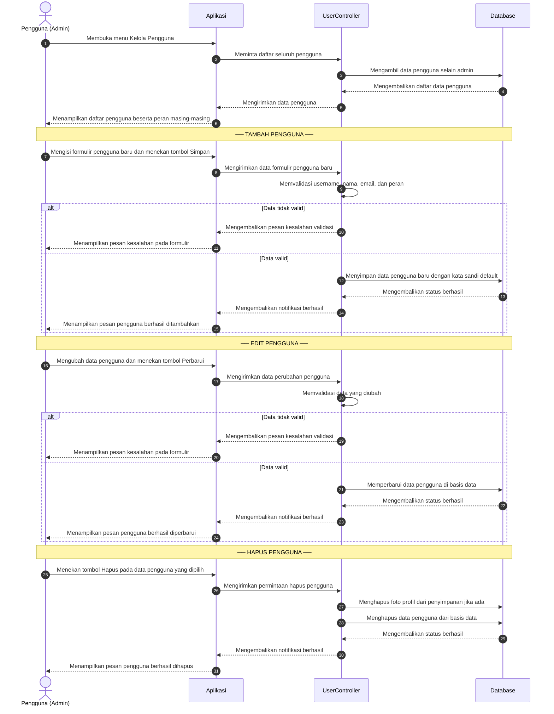
```mermaid
sequenceDiagram
    autonumber
    actor Pengguna as Pengguna (Admin)
    participant Aplikasi as Aplikasi
    participant Controller as UserController
    participant Database as Database

    Pengguna->>Aplikasi: Membuka menu Kelola Pengguna
    Aplikasi->>Controller: Meminta daftar seluruh pengguna
    Controller->>Database: Mengambil data pengguna selain admin
    Database-->>Controller: Mengembalikan daftar data pengguna
    Controller-->>Aplikasi: Mengirimkan data pengguna
    Aplikasi-->>Pengguna: Menampilkan daftar pengguna beserta peran masing-masing

    Note over Pengguna, Database: ── TAMBAH PENGGUNA ──

    Pengguna->>Aplikasi: Mengisi formulir pengguna baru dan menekan tombol Simpan
    Aplikasi->>Controller: Mengirimkan data formulir pengguna baru
    Controller->>Controller: Memvalidasi username, nama, email, dan peran

    alt Data tidak valid
        Controller-->>Aplikasi: Mengembalikan pesan kesalahan validasi
        Aplikasi-->>Pengguna: Menampilkan pesan kesalahan pada formulir
    else Data valid
        Controller->>Database: Menyimpan data pengguna baru dengan kata sandi default
        Database-->>Controller: Mengembalikan status berhasil
        Controller-->>Aplikasi: Mengembalikan notifikasi berhasil
        Aplikasi-->>Pengguna: Menampilkan pesan pengguna berhasil ditambahkan
    end

    Note over Pengguna, Database: ── EDIT PENGGUNA ──

    Pengguna->>Aplikasi: Mengubah data pengguna dan menekan tombol Perbarui
    Aplikasi->>Controller: Mengirimkan data perubahan pengguna
    Controller->>Controller: Memvalidasi data yang diubah

    alt Data tidak valid
        Controller-->>Aplikasi: Mengembalikan pesan kesalahan validasi
        Aplikasi-->>Pengguna: Menampilkan pesan kesalahan pada formulir
    else Data valid
        Controller->>Database: Memperbarui data pengguna di basis data
        Database-->>Controller: Mengembalikan status berhasil
        Controller-->>Aplikasi: Mengembalikan notifikasi berhasil
        Aplikasi-->>Pengguna: Menampilkan pesan pengguna berhasil diperbarui
    end

    Note over Pengguna, Database: ── HAPUS PENGGUNA ──

    Pengguna->>Aplikasi: Menekan tombol Hapus pada data pengguna yang dipilih
    Aplikasi->>Controller: Mengirimkan permintaan hapus pengguna
    Controller->>Database: Menghapus foto profil dari penyimpanan jika ada
    Controller->>Database: Menghapus data pengguna dari basis data
    Database-->>Controller: Mengembalikan status berhasil
    Controller-->>Aplikasi: Mengembalikan notifikasi berhasil
    Aplikasi-->>Pengguna: Menampilkan pesan pengguna berhasil dihapus
```

---

## 1.3 Sequence Kelola Kriteria Penilaian (Tambah, Edit, Hapus)

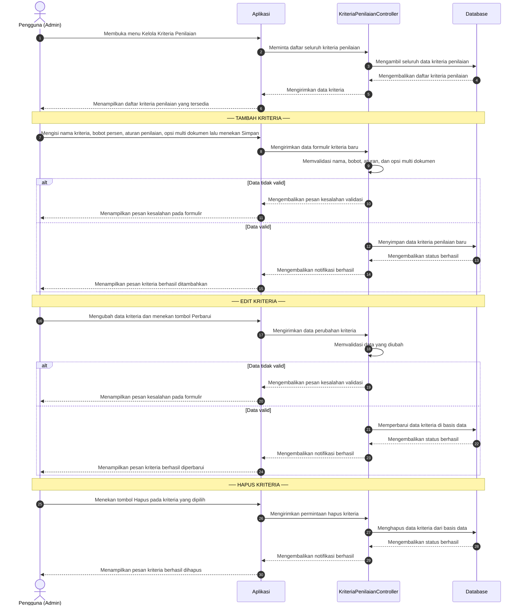
```mermaid
sequenceDiagram
    autonumber
    actor Pengguna as Pengguna (Admin)
    participant Aplikasi as Aplikasi
    participant Controller as KriteriaPenilaianController
    participant Database as Database

    Pengguna->>Aplikasi: Membuka menu Kelola Kriteria Penilaian
    Aplikasi->>Controller: Meminta daftar seluruh kriteria penilaian
    Controller->>Database: Mengambil seluruh data kriteria penilaian
    Database-->>Controller: Mengembalikan daftar kriteria penilaian
    Controller-->>Aplikasi: Mengirimkan data kriteria
    Aplikasi-->>Pengguna: Menampilkan daftar kriteria penilaian yang tersedia

    Note over Pengguna, Database: ── TAMBAH KRITERIA ──

    Pengguna->>Aplikasi: Mengisi nama kriteria, bobot persen, aturan penilaian, opsi multi dokumen lalu menekan Simpan
    Aplikasi->>Controller: Mengirimkan data formulir kriteria baru
    Controller->>Controller: Memvalidasi nama, bobot, aturan, dan opsi multi dokumen

    alt Data tidak valid
        Controller-->>Aplikasi: Mengembalikan pesan kesalahan validasi
        Aplikasi-->>Pengguna: Menampilkan pesan kesalahan pada formulir
    else Data valid
        Controller->>Database: Menyimpan data kriteria penilaian baru
        Database-->>Controller: Mengembalikan status berhasil
        Controller-->>Aplikasi: Mengembalikan notifikasi berhasil
        Aplikasi-->>Pengguna: Menampilkan pesan kriteria berhasil ditambahkan
    end

    Note over Pengguna, Database: ── EDIT KRITERIA ──

    Pengguna->>Aplikasi: Mengubah data kriteria dan menekan tombol Perbarui
    Aplikasi->>Controller: Mengirimkan data perubahan kriteria
    Controller->>Controller: Memvalidasi data yang diubah

    alt Data tidak valid
        Controller-->>Aplikasi: Mengembalikan pesan kesalahan validasi
        Aplikasi-->>Pengguna: Menampilkan pesan kesalahan pada formulir
    else Data valid
        Controller->>Database: Memperbarui data kriteria di basis data
        Database-->>Controller: Mengembalikan status berhasil
        Controller-->>Aplikasi: Mengembalikan notifikasi berhasil
        Aplikasi-->>Pengguna: Menampilkan pesan kriteria berhasil diperbarui
    end

    Note over Pengguna, Database: ── HAPUS KRITERIA ──

    Pengguna->>Aplikasi: Menekan tombol Hapus pada kriteria yang dipilih
    Aplikasi->>Controller: Mengirimkan permintaan hapus kriteria
    Controller->>Database: Menghapus data kriteria dari basis data
    Database-->>Controller: Mengembalikan status berhasil
    Controller-->>Aplikasi: Mengembalikan notifikasi berhasil
    Aplikasi-->>Pengguna: Menampilkan pesan kriteria berhasil dihapus
```

---

## 1.4 Sequence Kelola Penempatan (Tambah, Edit, Hapus)

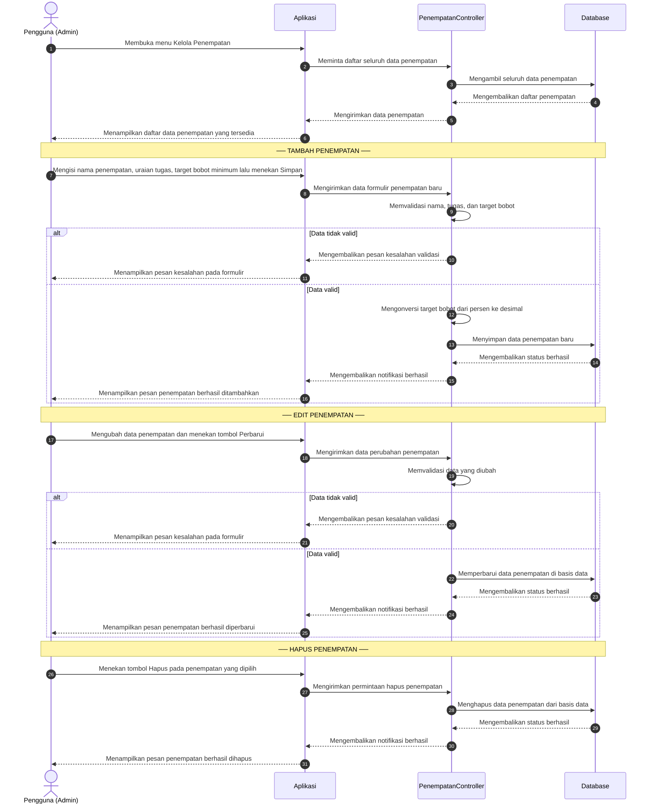
```mermaid
sequenceDiagram
    autonumber
    actor Pengguna as Pengguna (Admin)
    participant Aplikasi as Aplikasi
    participant Controller as PenempatanController
    participant Database as Database

    Pengguna->>Aplikasi: Membuka menu Kelola Penempatan
    Aplikasi->>Controller: Meminta daftar seluruh data penempatan
    Controller->>Database: Mengambil seluruh data penempatan
    Database-->>Controller: Mengembalikan daftar penempatan
    Controller-->>Aplikasi: Mengirimkan data penempatan
    Aplikasi-->>Pengguna: Menampilkan daftar data penempatan yang tersedia

    Note over Pengguna, Database: ── TAMBAH PENEMPATAN ──

    Pengguna->>Aplikasi: Mengisi nama penempatan, uraian tugas, target bobot minimum lalu menekan Simpan
    Aplikasi->>Controller: Mengirimkan data formulir penempatan baru
    Controller->>Controller: Memvalidasi nama, tugas, dan target bobot

    alt Data tidak valid
        Controller-->>Aplikasi: Mengembalikan pesan kesalahan validasi
        Aplikasi-->>Pengguna: Menampilkan pesan kesalahan pada formulir
    else Data valid
        Controller->>Controller: Mengonversi target bobot dari persen ke desimal
        Controller->>Database: Menyimpan data penempatan baru
        Database-->>Controller: Mengembalikan status berhasil
        Controller-->>Aplikasi: Mengembalikan notifikasi berhasil
        Aplikasi-->>Pengguna: Menampilkan pesan penempatan berhasil ditambahkan
    end

    Note over Pengguna, Database: ── EDIT PENEMPATAN ──

    Pengguna->>Aplikasi: Mengubah data penempatan dan menekan tombol Perbarui
    Aplikasi->>Controller: Mengirimkan data perubahan penempatan
    Controller->>Controller: Memvalidasi data yang diubah

    alt Data tidak valid
        Controller-->>Aplikasi: Mengembalikan pesan kesalahan validasi
        Aplikasi-->>Pengguna: Menampilkan pesan kesalahan pada formulir
    else Data valid
        Controller->>Database: Memperbarui data penempatan di basis data
        Database-->>Controller: Mengembalikan status berhasil
        Controller-->>Aplikasi: Mengembalikan notifikasi berhasil
        Aplikasi-->>Pengguna: Menampilkan pesan penempatan berhasil diperbarui
    end

    Note over Pengguna, Database: ── HAPUS PENEMPATAN ──

    Pengguna->>Aplikasi: Menekan tombol Hapus pada penempatan yang dipilih
    Aplikasi->>Controller: Mengirimkan permintaan hapus penempatan
    Controller->>Database: Menghapus data penempatan dari basis data
    Database-->>Controller: Mengembalikan status berhasil
    Controller-->>Aplikasi: Mengembalikan notifikasi berhasil
    Aplikasi-->>Pengguna: Menampilkan pesan penempatan berhasil dihapus
```

---

## 1.5 Sequence Pengaturan Sistem

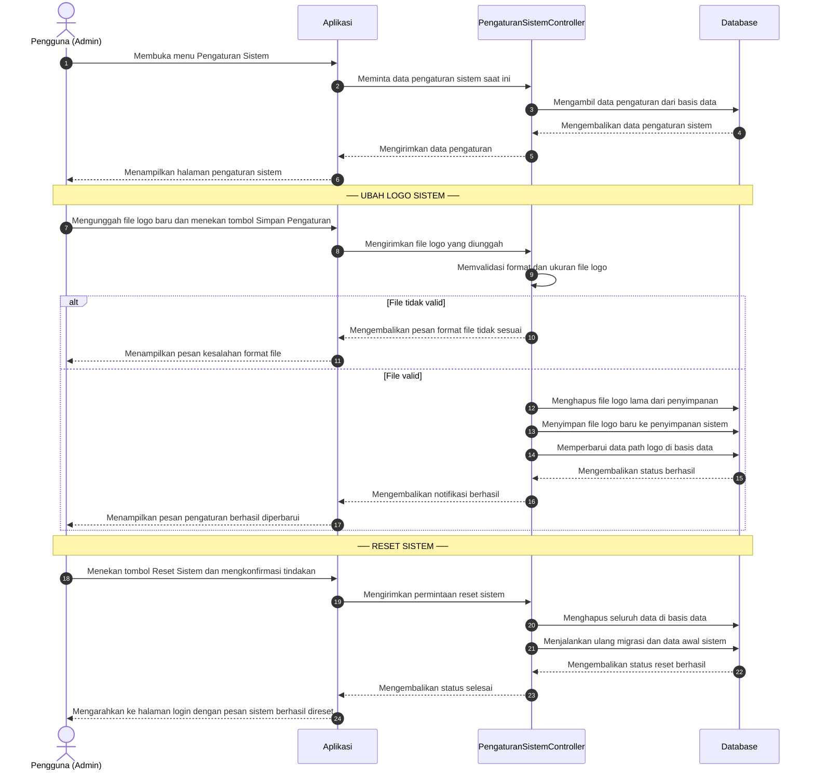
```mermaid
sequenceDiagram
    autonumber
    actor Pengguna as Pengguna (Admin)
    participant Aplikasi as Aplikasi
    participant Controller as PengaturanSistemController
    participant Database as Database

    Pengguna->>Aplikasi: Membuka menu Pengaturan Sistem
    Aplikasi->>Controller: Meminta data pengaturan sistem saat ini
    Controller->>Database: Mengambil data pengaturan dari basis data
    Database-->>Controller: Mengembalikan data pengaturan sistem
    Controller-->>Aplikasi: Mengirimkan data pengaturan
    Aplikasi-->>Pengguna: Menampilkan halaman pengaturan sistem

    Note over Pengguna, Database: ── UBAH LOGO SISTEM ──

    Pengguna->>Aplikasi: Mengunggah file logo baru dan menekan tombol Simpan Pengaturan
    Aplikasi->>Controller: Mengirimkan file logo yang diunggah
    Controller->>Controller: Memvalidasi format dan ukuran file logo

    alt File tidak valid
        Controller-->>Aplikasi: Mengembalikan pesan format file tidak sesuai
        Aplikasi-->>Pengguna: Menampilkan pesan kesalahan format file
    else File valid
        Controller->>Database: Menghapus file logo lama dari penyimpanan
        Controller->>Database: Menyimpan file logo baru ke penyimpanan sistem
        Controller->>Database: Memperbarui data path logo di basis data
        Database-->>Controller: Mengembalikan status berhasil
        Controller-->>Aplikasi: Mengembalikan notifikasi berhasil
        Aplikasi-->>Pengguna: Menampilkan pesan pengaturan berhasil diperbarui
    end

    Note over Pengguna, Database: ── RESET SISTEM ──

    Pengguna->>Aplikasi: Menekan tombol Reset Sistem dan mengkonfirmasi tindakan
    Aplikasi->>Controller: Mengirimkan permintaan reset sistem
    Controller->>Database: Menghapus seluruh data di basis data
    Controller->>Database: Menjalankan ulang migrasi dan data awal sistem
    Database-->>Controller: Mengembalikan status reset berhasil
    Controller-->>Aplikasi: Mengembalikan status selesai
    Aplikasi-->>Pengguna: Mengarahkan ke halaman login dengan pesan sistem berhasil direset
```

---

# 2. SEQUENCE DIAGRAM PESERTA (USER)

---

## 2.1 Sequence Registrasi Akun dan Verifikasi OTP

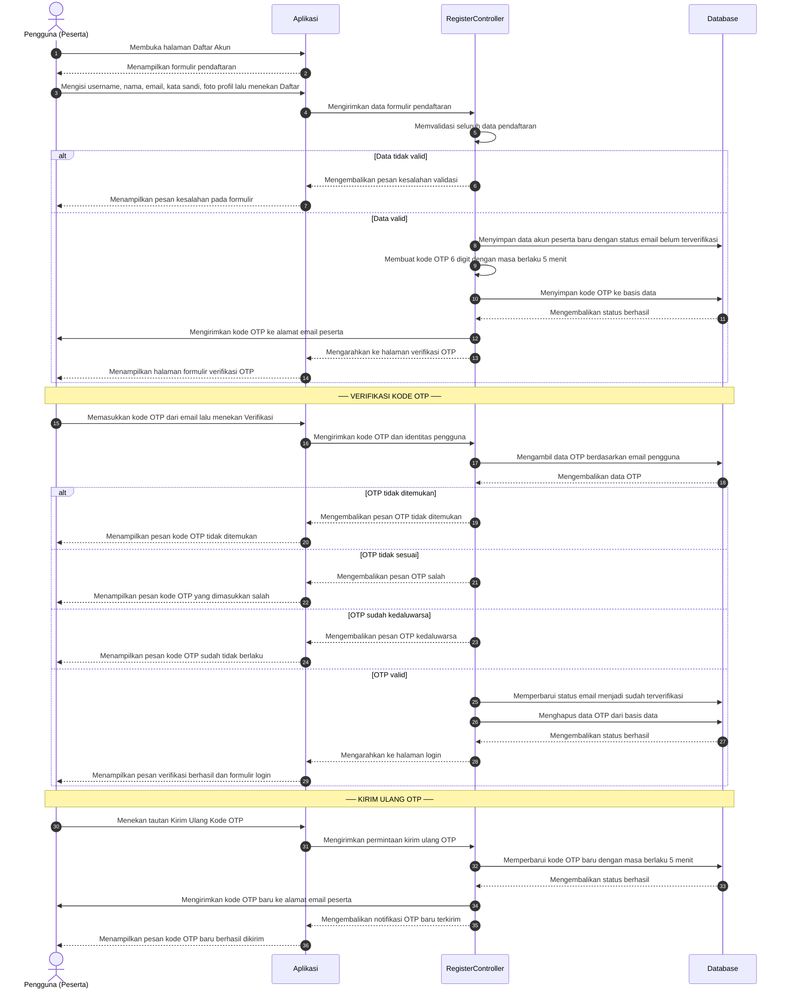
```mermaid
sequenceDiagram
    autonumber
    actor Pengguna as Pengguna (Peserta)
    participant Aplikasi as Aplikasi
    participant Controller as RegisterController
    participant Database as Database

    Pengguna->>Aplikasi: Membuka halaman Daftar Akun
    Aplikasi-->>Pengguna: Menampilkan formulir pendaftaran

    Pengguna->>Aplikasi: Mengisi username, nama, email, kata sandi, foto profil lalu menekan Daftar
    Aplikasi->>Controller: Mengirimkan data formulir pendaftaran
    Controller->>Controller: Memvalidasi seluruh data pendaftaran

    alt Data tidak valid
        Controller-->>Aplikasi: Mengembalikan pesan kesalahan validasi
        Aplikasi-->>Pengguna: Menampilkan pesan kesalahan pada formulir
    else Data valid
        Controller->>Database: Menyimpan data akun peserta baru dengan status email belum terverifikasi
        Controller->>Controller: Membuat kode OTP 6 digit dengan masa berlaku 5 menit
        Controller->>Database: Menyimpan kode OTP ke basis data
        Database-->>Controller: Mengembalikan status berhasil
        Controller->>Pengguna: Mengirimkan kode OTP ke alamat email peserta
        Controller-->>Aplikasi: Mengarahkan ke halaman verifikasi OTP
        Aplikasi-->>Pengguna: Menampilkan halaman formulir verifikasi OTP
    end

    Note over Pengguna, Database: ── VERIFIKASI KODE OTP ──

    Pengguna->>Aplikasi: Memasukkan kode OTP dari email lalu menekan Verifikasi
    Aplikasi->>Controller: Mengirimkan kode OTP dan identitas pengguna
    Controller->>Database: Mengambil data OTP berdasarkan email pengguna
    Database-->>Controller: Mengembalikan data OTP

    alt OTP tidak ditemukan
        Controller-->>Aplikasi: Mengembalikan pesan OTP tidak ditemukan
        Aplikasi-->>Pengguna: Menampilkan pesan kode OTP tidak ditemukan
    else OTP tidak sesuai
        Controller-->>Aplikasi: Mengembalikan pesan OTP salah
        Aplikasi-->>Pengguna: Menampilkan pesan kode OTP yang dimasukkan salah
    else OTP sudah kedaluwarsa
        Controller-->>Aplikasi: Mengembalikan pesan OTP kedaluwarsa
        Aplikasi-->>Pengguna: Menampilkan pesan kode OTP sudah tidak berlaku
    else OTP valid
        Controller->>Database: Memperbarui status email menjadi sudah terverifikasi
        Controller->>Database: Menghapus data OTP dari basis data
        Database-->>Controller: Mengembalikan status berhasil
        Controller-->>Aplikasi: Mengarahkan ke halaman login
        Aplikasi-->>Pengguna: Menampilkan pesan verifikasi berhasil dan formulir login
    end

    Note over Pengguna, Database: ── KIRIM ULANG OTP ──

    Pengguna->>Aplikasi: Menekan tautan Kirim Ulang Kode OTP
    Aplikasi->>Controller: Mengirimkan permintaan kirim ulang OTP
    Controller->>Database: Memperbarui kode OTP baru dengan masa berlaku 5 menit
    Database-->>Controller: Mengembalikan status berhasil
    Controller->>Pengguna: Mengirimkan kode OTP baru ke alamat email peserta
    Controller-->>Aplikasi: Mengembalikan notifikasi OTP baru terkirim
    Aplikasi-->>Pengguna: Menampilkan pesan kode OTP baru berhasil dikirim
```

---

## 2.2 Sequence Login dan Logout Peserta

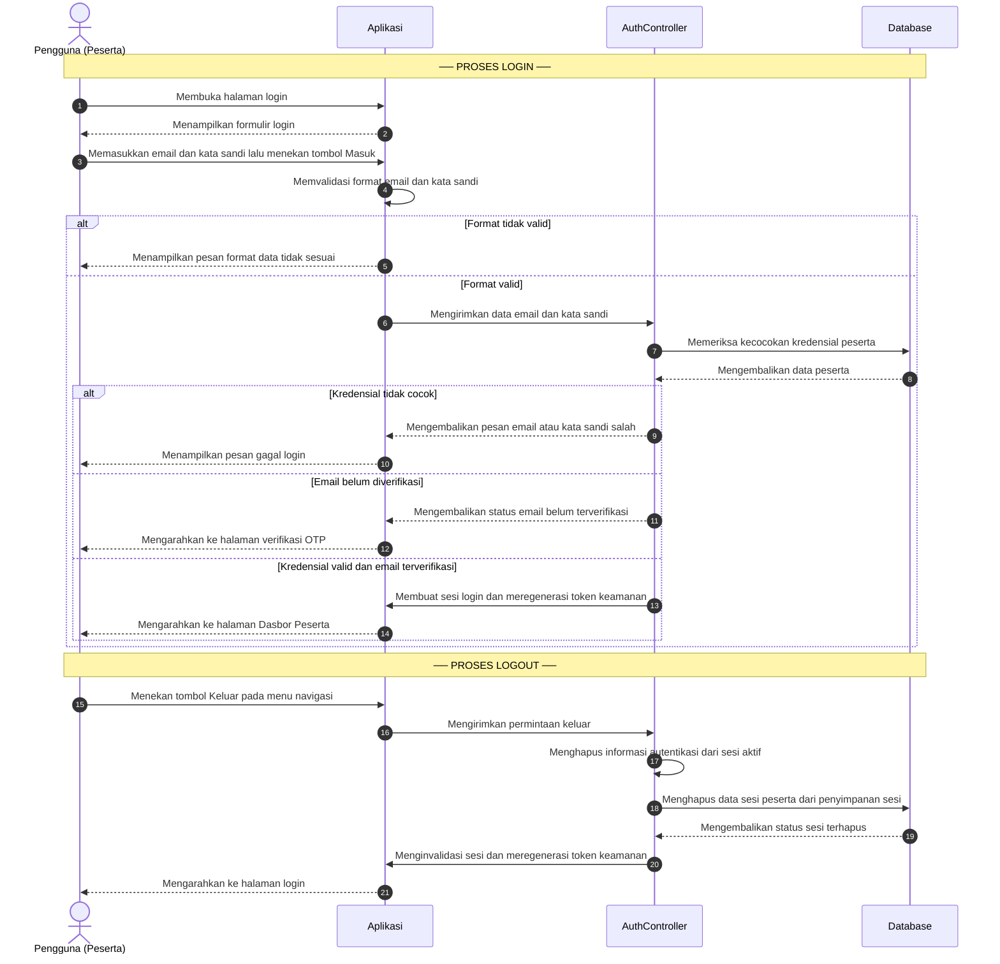
```mermaid
sequenceDiagram
    autonumber
    actor Pengguna as Pengguna (Peserta)
    participant Aplikasi as Aplikasi
    participant Controller as AuthController
    participant Database as Database

    Note over Pengguna, Database: ── PROSES LOGIN ──

    Pengguna->>Aplikasi: Membuka halaman login
    Aplikasi-->>Pengguna: Menampilkan formulir login

    Pengguna->>Aplikasi: Memasukkan email dan kata sandi lalu menekan tombol Masuk
    Aplikasi->>Aplikasi: Memvalidasi format email dan kata sandi

    alt Format tidak valid
        Aplikasi-->>Pengguna: Menampilkan pesan format data tidak sesuai
    else Format valid
        Aplikasi->>Controller: Mengirimkan data email dan kata sandi
        Controller->>Database: Memeriksa kecocokan kredensial peserta
        Database-->>Controller: Mengembalikan data peserta

        alt Kredensial tidak cocok
            Controller-->>Aplikasi: Mengembalikan pesan email atau kata sandi salah
            Aplikasi-->>Pengguna: Menampilkan pesan gagal login
        else Email belum diverifikasi
            Controller-->>Aplikasi: Mengembalikan status email belum terverifikasi
            Aplikasi-->>Pengguna: Mengarahkan ke halaman verifikasi OTP
        else Kredensial valid dan email terverifikasi
            Controller->>Aplikasi: Membuat sesi login dan meregenerasi token keamanan
            Aplikasi-->>Pengguna: Mengarahkan ke halaman Dasbor Peserta
        end
    end

    Note over Pengguna, Database: ── PROSES LOGOUT ──

    Pengguna->>Aplikasi: Menekan tombol Keluar pada menu navigasi
    Aplikasi->>Controller: Mengirimkan permintaan keluar
    Controller->>Controller: Menghapus informasi autentikasi dari sesi aktif
    Controller->>Database: Menghapus data sesi peserta dari penyimpanan sesi
    Database-->>Controller: Mengembalikan status sesi terhapus
    Controller->>Aplikasi: Menginvalidasi sesi dan meregenerasi token keamanan
    Aplikasi-->>Pengguna: Mengarahkan ke halaman login
```

---

## 2.3 Sequence Unggah Berkas Penilaian

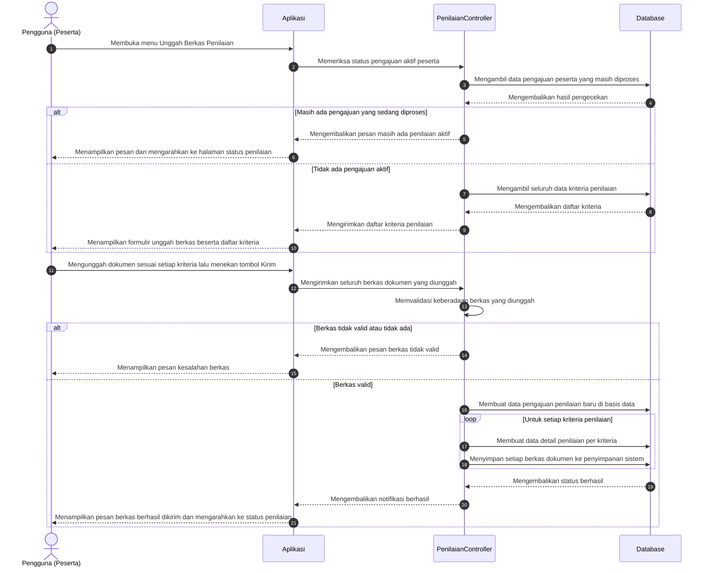
```mermaid
sequenceDiagram
    autonumber
    actor Pengguna as Pengguna (Peserta)
    participant Aplikasi as Aplikasi
    participant Controller as PenilaianController
    participant Database as Database

    Pengguna->>Aplikasi: Membuka menu Unggah Berkas Penilaian
    Aplikasi->>Controller: Memeriksa status pengajuan aktif peserta
    Controller->>Database: Mengambil data pengajuan peserta yang masih diproses
    Database-->>Controller: Mengembalikan hasil pengecekan

    alt Masih ada pengajuan yang sedang diproses
        Controller-->>Aplikasi: Mengembalikan pesan masih ada penilaian aktif
        Aplikasi-->>Pengguna: Menampilkan pesan dan mengarahkan ke halaman status penilaian
    else Tidak ada pengajuan aktif
        Controller->>Database: Mengambil seluruh data kriteria penilaian
        Database-->>Controller: Mengembalikan daftar kriteria
        Controller-->>Aplikasi: Mengirimkan daftar kriteria penilaian
        Aplikasi-->>Pengguna: Menampilkan formulir unggah berkas beserta daftar kriteria
    end

    Pengguna->>Aplikasi: Mengunggah dokumen sesuai setiap kriteria lalu menekan tombol Kirim
    Aplikasi->>Controller: Mengirimkan seluruh berkas dokumen yang diunggah
    Controller->>Controller: Memvalidasi keberadaan berkas yang diunggah

    alt Berkas tidak valid atau tidak ada
        Controller-->>Aplikasi: Mengembalikan pesan berkas tidak valid
        Aplikasi-->>Pengguna: Menampilkan pesan kesalahan berkas
    else Berkas valid
        Controller->>Database: Membuat data pengajuan penilaian baru di basis data
        loop Untuk setiap kriteria penilaian
            Controller->>Database: Membuat data detail penilaian per kriteria
            Controller->>Database: Menyimpan setiap berkas dokumen ke penyimpanan sistem
        end
        Database-->>Controller: Mengembalikan status berhasil
        Controller-->>Aplikasi: Mengembalikan notifikasi berhasil
        Aplikasi-->>Pengguna: Menampilkan pesan berkas berhasil dikirim dan mengarahkan ke status penilaian
    end
```

---

## 2.4 Sequence Lihat Status Penilaian

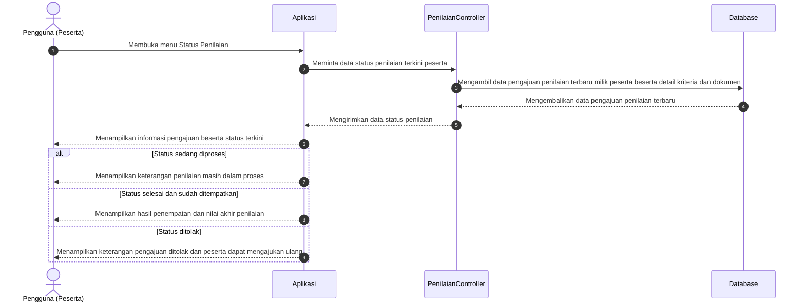
```mermaid
sequenceDiagram
    autonumber
    actor Pengguna as Pengguna (Peserta)
    participant Aplikasi as Aplikasi
    participant Controller as PenilaianController
    participant Database as Database

    Pengguna->>Aplikasi: Membuka menu Status Penilaian
    Aplikasi->>Controller: Meminta data status penilaian terkini peserta
    Controller->>Database: Mengambil data pengajuan penilaian terbaru milik peserta beserta detail kriteria dan dokumen
    Database-->>Controller: Mengembalikan data pengajuan penilaian terbaru
    Controller-->>Aplikasi: Mengirimkan data status penilaian
    Aplikasi-->>Pengguna: Menampilkan informasi pengajuan beserta status terkini

    alt Status sedang diproses
        Aplikasi-->>Pengguna: Menampilkan keterangan penilaian masih dalam proses
    else Status selesai dan sudah ditempatkan
        Aplikasi-->>Pengguna: Menampilkan hasil penempatan dan nilai akhir penilaian
    else Status ditolak
        Aplikasi-->>Pengguna: Menampilkan keterangan pengajuan ditolak dan peserta dapat mengajukan ulang
    end
```

---

## 2.5 Sequence Riwayat Penilaian

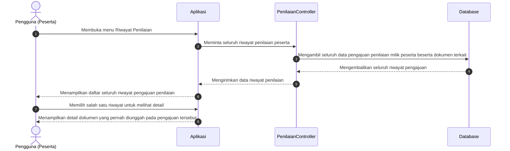
```mermaid
sequenceDiagram
    autonumber
    actor Pengguna as Pengguna (Peserta)
    participant Aplikasi as Aplikasi
    participant Controller as PenilaianController
    participant Database as Database

    Pengguna->>Aplikasi: Membuka menu Riwayat Penilaian
    Aplikasi->>Controller: Meminta seluruh riwayat penilaian peserta
    Controller->>Database: Mengambil seluruh data pengajuan penilaian milik peserta beserta dokumen terkait
    Database-->>Controller: Mengembalikan seluruh riwayat pengajuan
    Controller-->>Aplikasi: Mengirimkan data riwayat penilaian
    Aplikasi-->>Pengguna: Menampilkan daftar seluruh riwayat pengajuan penilaian

    Pengguna->>Aplikasi: Memilih salah satu riwayat untuk melihat detail
    Aplikasi-->>Pengguna: Menampilkan detail dokumen yang pernah diunggah pada pengajuan tersebut
```

---

## 2.6 Sequence Kelola Profil Peserta

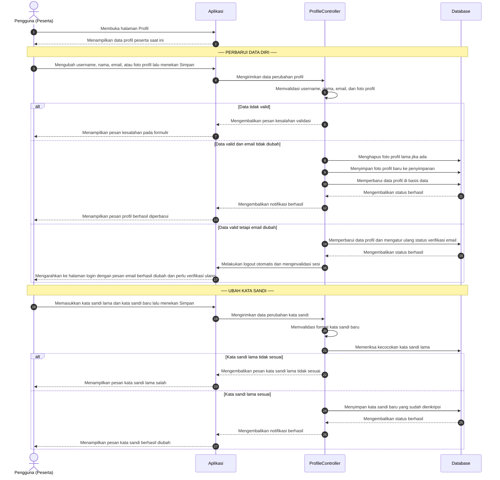
```mermaid
sequenceDiagram
    autonumber
    actor Pengguna as Pengguna (Peserta)
    participant Aplikasi as Aplikasi
    participant Controller as ProfileController
    participant Database as Database

    Pengguna->>Aplikasi: Membuka halaman Profil
    Aplikasi-->>Pengguna: Menampilkan data profil peserta saat ini

    Note over Pengguna, Database: ── PERBARUI DATA DIRI ──

    Pengguna->>Aplikasi: Mengubah username, nama, email, atau foto profil lalu menekan Simpan
    Aplikasi->>Controller: Mengirimkan data perubahan profil
    Controller->>Controller: Memvalidasi username, nama, email, dan foto profil

    alt Data tidak valid
        Controller-->>Aplikasi: Mengembalikan pesan kesalahan validasi
        Aplikasi-->>Pengguna: Menampilkan pesan kesalahan pada formulir
    else Data valid dan email tidak diubah
        Controller->>Database: Menghapus foto profil lama jika ada
        Controller->>Database: Menyimpan foto profil baru ke penyimpanan
        Controller->>Database: Memperbarui data profil di basis data
        Database-->>Controller: Mengembalikan status berhasil
        Controller-->>Aplikasi: Mengembalikan notifikasi berhasil
        Aplikasi-->>Pengguna: Menampilkan pesan profil berhasil diperbarui
    else Data valid tetapi email diubah
        Controller->>Database: Memperbarui data profil dan mengatur ulang status verifikasi email
        Database-->>Controller: Mengembalikan status berhasil
        Controller->>Aplikasi: Melakukan logout otomatis dan menginvalidasi sesi
        Aplikasi-->>Pengguna: Mengarahkan ke halaman login dengan pesan email berhasil diubah dan perlu verifikasi ulang
    end

    Note over Pengguna, Database: ── UBAH KATA SANDI ──

    Pengguna->>Aplikasi: Memasukkan kata sandi lama dan kata sandi baru lalu menekan Simpan
    Aplikasi->>Controller: Mengirimkan data perubahan kata sandi
    Controller->>Controller: Memvalidasi format kata sandi baru
    Controller->>Database: Memeriksa kecocokan kata sandi lama

    alt Kata sandi lama tidak sesuai
        Controller-->>Aplikasi: Mengembalikan pesan kata sandi lama tidak sesuai
        Aplikasi-->>Pengguna: Menampilkan pesan kata sandi lama salah
    else Kata sandi lama sesuai
        Controller->>Database: Menyimpan kata sandi baru yang sudah dienkripsi
        Database-->>Controller: Mengembalikan status berhasil
        Controller-->>Aplikasi: Mengembalikan notifikasi berhasil
        Aplikasi-->>Pengguna: Menampilkan pesan kata sandi berhasil diubah
    end
```

---

# 3. SEQUENCE DIAGRAM PENANGGUNG JAWAB

---

## 3.1 Sequence Login dan Logout Penanggung Jawab

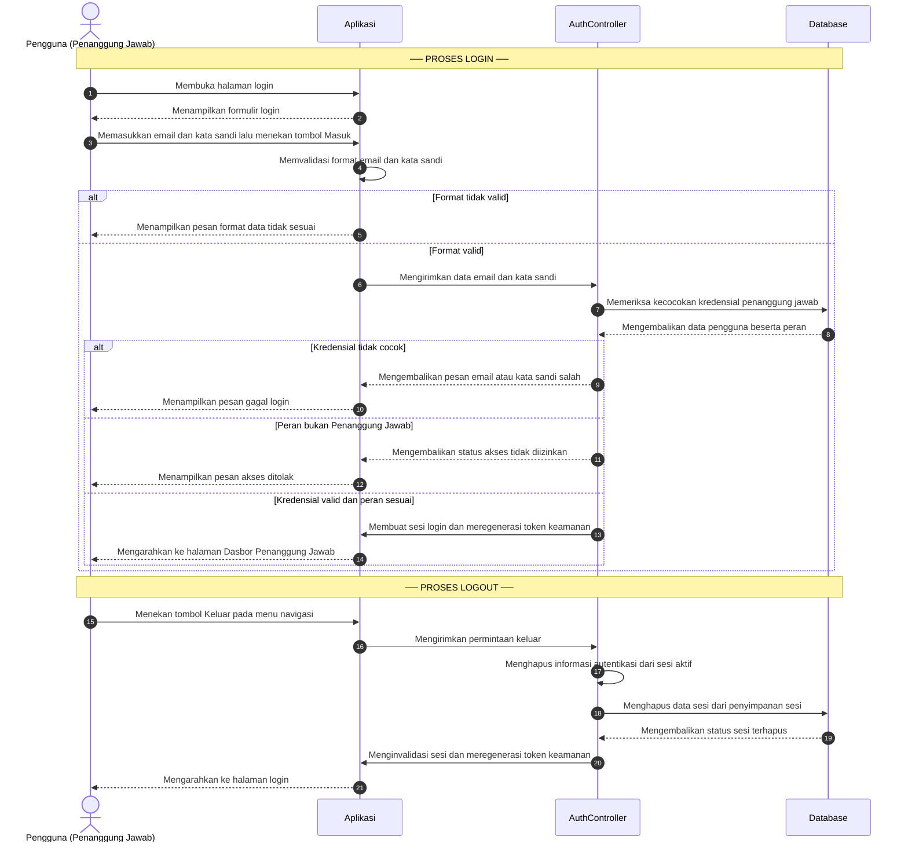
```mermaid
sequenceDiagram
    autonumber
    actor Pengguna as Pengguna (Penanggung Jawab)
    participant Aplikasi as Aplikasi
    participant Controller as AuthController
    participant Database as Database

    Note over Pengguna, Database: ── PROSES LOGIN ──

    Pengguna->>Aplikasi: Membuka halaman login
    Aplikasi-->>Pengguna: Menampilkan formulir login

    Pengguna->>Aplikasi: Memasukkan email dan kata sandi lalu menekan tombol Masuk
    Aplikasi->>Aplikasi: Memvalidasi format email dan kata sandi

    alt Format tidak valid
        Aplikasi-->>Pengguna: Menampilkan pesan format data tidak sesuai
    else Format valid
        Aplikasi->>Controller: Mengirimkan data email dan kata sandi
        Controller->>Database: Memeriksa kecocokan kredensial penanggung jawab
        Database-->>Controller: Mengembalikan data pengguna beserta peran

        alt Kredensial tidak cocok
            Controller-->>Aplikasi: Mengembalikan pesan email atau kata sandi salah
            Aplikasi-->>Pengguna: Menampilkan pesan gagal login
        else Peran bukan Penanggung Jawab
            Controller-->>Aplikasi: Mengembalikan status akses tidak diizinkan
            Aplikasi-->>Pengguna: Menampilkan pesan akses ditolak
        else Kredensial valid dan peran sesuai
            Controller->>Aplikasi: Membuat sesi login dan meregenerasi token keamanan
            Aplikasi-->>Pengguna: Mengarahkan ke halaman Dasbor Penanggung Jawab
        end
    end

    Note over Pengguna, Database: ── PROSES LOGOUT ──

    Pengguna->>Aplikasi: Menekan tombol Keluar pada menu navigasi
    Aplikasi->>Controller: Mengirimkan permintaan keluar
    Controller->>Controller: Menghapus informasi autentikasi dari sesi aktif
    Controller->>Database: Menghapus data sesi dari penyimpanan sesi
    Database-->>Controller: Mengembalikan status sesi terhapus
    Controller->>Aplikasi: Menginvalidasi sesi dan meregenerasi token keamanan
    Aplikasi-->>Pengguna: Mengarahkan ke halaman login
```

---

## 3.2 Sequence Proses Penilaian Otomatis dengan Kecerdasan Buatan

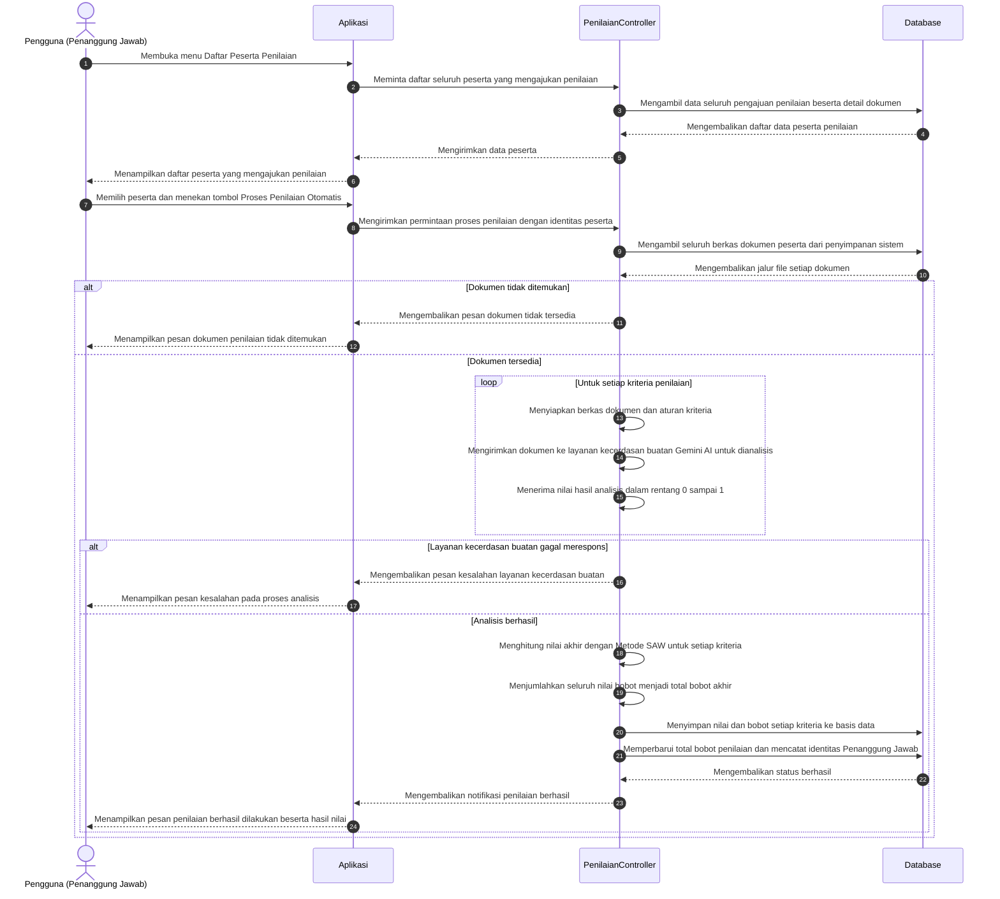
```mermaid
sequenceDiagram
    autonumber
    actor Pengguna as Pengguna (Penanggung Jawab)
    participant Aplikasi as Aplikasi
    participant Controller as PenilaianController
    participant Database as Database

    Pengguna->>Aplikasi: Membuka menu Daftar Peserta Penilaian
    Aplikasi->>Controller: Meminta daftar seluruh peserta yang mengajukan penilaian
    Controller->>Database: Mengambil data seluruh pengajuan penilaian beserta detail dokumen
    Database-->>Controller: Mengembalikan daftar data peserta penilaian
    Controller-->>Aplikasi: Mengirimkan data peserta
    Aplikasi-->>Pengguna: Menampilkan daftar peserta yang mengajukan penilaian

    Pengguna->>Aplikasi: Memilih peserta dan menekan tombol Proses Penilaian Otomatis
    Aplikasi->>Controller: Mengirimkan permintaan proses penilaian dengan identitas peserta
    Controller->>Database: Mengambil seluruh berkas dokumen peserta dari penyimpanan sistem
    Database-->>Controller: Mengembalikan jalur file setiap dokumen

    alt Dokumen tidak ditemukan
        Controller-->>Aplikasi: Mengembalikan pesan dokumen tidak tersedia
        Aplikasi-->>Pengguna: Menampilkan pesan dokumen penilaian tidak ditemukan
    else Dokumen tersedia
        loop Untuk setiap kriteria penilaian
            Controller->>Controller: Menyiapkan berkas dokumen dan aturan kriteria
            Controller->>Controller: Mengirimkan dokumen ke layanan kecerdasan buatan Gemini AI untuk dianalisis
            Controller->>Controller: Menerima nilai hasil analisis dalam rentang 0 sampai 1
        end

        alt Layanan kecerdasan buatan gagal merespons
            Controller-->>Aplikasi: Mengembalikan pesan kesalahan layanan kecerdasan buatan
            Aplikasi-->>Pengguna: Menampilkan pesan kesalahan pada proses analisis
        else Analisis berhasil
            Controller->>Controller: Menghitung nilai akhir dengan Metode SAW untuk setiap kriteria
            Controller->>Controller: Menjumlahkan seluruh nilai bobot menjadi total bobot akhir
            Controller->>Database: Menyimpan nilai dan bobot setiap kriteria ke basis data
            Controller->>Database: Memperbarui total bobot penilaian dan mencatat identitas Penanggung Jawab
            Database-->>Controller: Mengembalikan status berhasil
            Controller-->>Aplikasi: Mengembalikan notifikasi penilaian berhasil
            Aplikasi-->>Pengguna: Menampilkan pesan penilaian berhasil dilakukan beserta hasil nilai
        end
    end
```

---

## 3.3 Sequence Tetapkan Penempatan Peserta

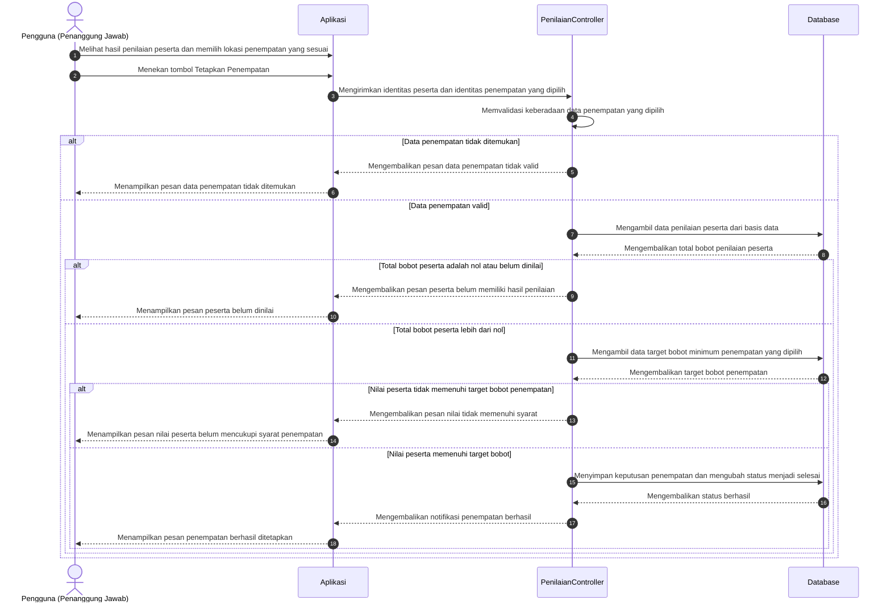
```mermaid
sequenceDiagram
    autonumber
    actor Pengguna as Pengguna (Penanggung Jawab)
    participant Aplikasi as Aplikasi
    participant Controller as PenilaianController
    participant Database as Database

    Pengguna->>Aplikasi: Melihat hasil penilaian peserta dan memilih lokasi penempatan yang sesuai
    Pengguna->>Aplikasi: Menekan tombol Tetapkan Penempatan
    Aplikasi->>Controller: Mengirimkan identitas peserta dan identitas penempatan yang dipilih
    Controller->>Controller: Memvalidasi keberadaan data penempatan yang dipilih

    alt Data penempatan tidak ditemukan
        Controller-->>Aplikasi: Mengembalikan pesan data penempatan tidak valid
        Aplikasi-->>Pengguna: Menampilkan pesan data penempatan tidak ditemukan
    else Data penempatan valid
        Controller->>Database: Mengambil data penilaian peserta dari basis data
        Database-->>Controller: Mengembalikan total bobot penilaian peserta

        alt Total bobot peserta adalah nol atau belum dinilai
            Controller-->>Aplikasi: Mengembalikan pesan peserta belum memiliki hasil penilaian
            Aplikasi-->>Pengguna: Menampilkan pesan peserta belum dinilai
        else Total bobot peserta lebih dari nol
            Controller->>Database: Mengambil data target bobot minimum penempatan yang dipilih
            Database-->>Controller: Mengembalikan target bobot penempatan

            alt Nilai peserta tidak memenuhi target bobot penempatan
                Controller-->>Aplikasi: Mengembalikan pesan nilai tidak memenuhi syarat
                Aplikasi-->>Pengguna: Menampilkan pesan nilai peserta belum mencukupi syarat penempatan
            else Nilai peserta memenuhi target bobot
                Controller->>Database: Menyimpan keputusan penempatan dan mengubah status menjadi selesai
                Database-->>Controller: Mengembalikan status berhasil
                Controller-->>Aplikasi: Mengembalikan notifikasi penempatan berhasil
                Aplikasi-->>Pengguna: Menampilkan pesan penempatan berhasil ditetapkan
            end
        end
    end
```

---

## 3.4 Sequence Tolak Peserta Penilaian

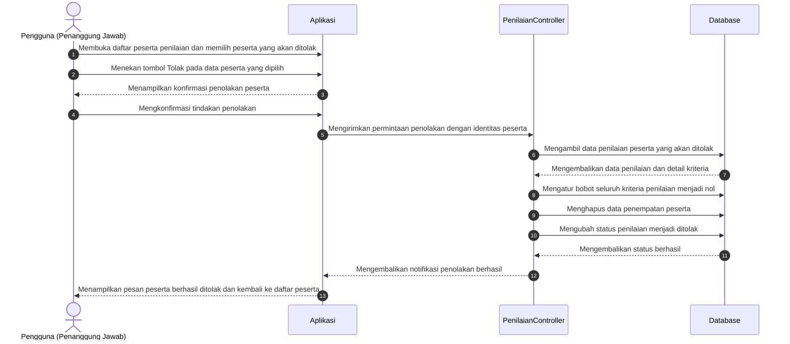
```mermaid
sequenceDiagram
    autonumber
    actor Pengguna as Pengguna (Penanggung Jawab)
    participant Aplikasi as Aplikasi
    participant Controller as PenilaianController
    participant Database as Database

    Pengguna->>Aplikasi: Membuka daftar peserta penilaian dan memilih peserta yang akan ditolak
    Pengguna->>Aplikasi: Menekan tombol Tolak pada data peserta yang dipilih
    Aplikasi-->>Pengguna: Menampilkan konfirmasi penolakan peserta

    Pengguna->>Aplikasi: Mengkonfirmasi tindakan penolakan
    Aplikasi->>Controller: Mengirimkan permintaan penolakan dengan identitas peserta
    Controller->>Database: Mengambil data penilaian peserta yang akan ditolak
    Database-->>Controller: Mengembalikan data penilaian dan detail kriteria

    Controller->>Database: Mengatur bobot seluruh kriteria penilaian menjadi nol
    Controller->>Database: Menghapus data penempatan peserta
    Controller->>Database: Mengubah status penilaian menjadi ditolak
    Database-->>Controller: Mengembalikan status berhasil

    Controller-->>Aplikasi: Mengembalikan notifikasi penolakan berhasil
    Aplikasi-->>Pengguna: Menampilkan pesan peserta berhasil ditolak dan kembali ke daftar peserta
```

---

## 3.5 Sequence Perbarui Bobot Penilaian secara Manual

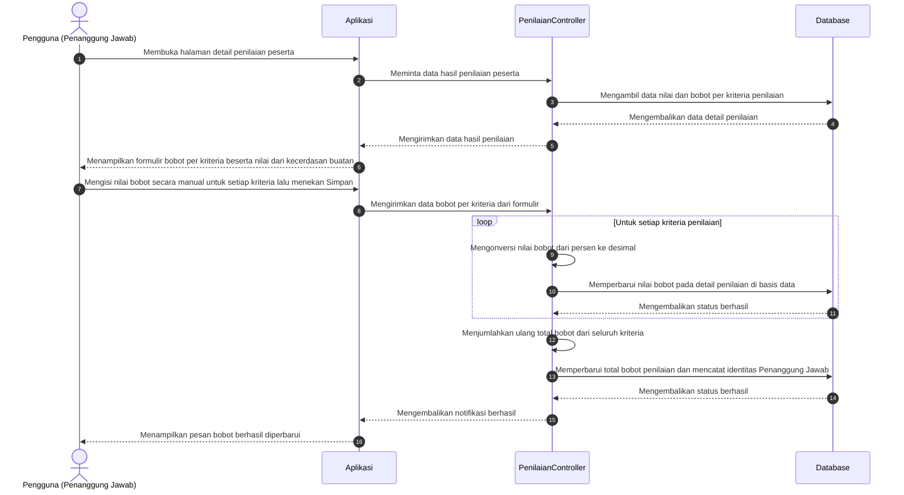
```mermaid
sequenceDiagram
    autonumber
    actor Pengguna as Pengguna (Penanggung Jawab)
    participant Aplikasi as Aplikasi
    participant Controller as PenilaianController
    participant Database as Database

    Pengguna->>Aplikasi: Membuka halaman detail penilaian peserta
    Aplikasi->>Controller: Meminta data hasil penilaian peserta
    Controller->>Database: Mengambil data nilai dan bobot per kriteria penilaian
    Database-->>Controller: Mengembalikan data detail penilaian
    Controller-->>Aplikasi: Mengirimkan data hasil penilaian
    Aplikasi-->>Pengguna: Menampilkan formulir bobot per kriteria beserta nilai dari kecerdasan buatan

    Pengguna->>Aplikasi: Mengisi nilai bobot secara manual untuk setiap kriteria lalu menekan Simpan
    Aplikasi->>Controller: Mengirimkan data bobot per kriteria dari formulir

    loop Untuk setiap kriteria penilaian
        Controller->>Controller: Mengonversi nilai bobot dari persen ke desimal
        Controller->>Database: Memperbarui nilai bobot pada detail penilaian di basis data
        Database-->>Controller: Mengembalikan status berhasil
    end

    Controller->>Controller: Menjumlahkan ulang total bobot dari seluruh kriteria
    Controller->>Database: Memperbarui total bobot penilaian dan mencatat identitas Penanggung Jawab
    Database-->>Controller: Mengembalikan status berhasil
    Controller-->>Aplikasi: Mengembalikan notifikasi berhasil
    Aplikasi-->>Pengguna: Menampilkan pesan bobot berhasil diperbarui
```

---

## Daftar Seluruh Sequence Diagram

| No | Kelompok | Nama Sequence Diagram |
|---|---|---|
| **1.1** | Admin | Login dan Logout Admin |
| **1.2** | Admin | Kelola Pengguna (Tambah, Edit, Hapus) |
| **1.3** | Admin | Kelola Kriteria Penilaian (Tambah, Edit, Hapus) |
| **1.4** | Admin | Kelola Penempatan (Tambah, Edit, Hapus) |
| **1.5** | Admin | Pengaturan Sistem (Logo dan Reset) |
| **2.1** | Peserta | Registrasi Akun dan Verifikasi OTP |
| **2.2** | Peserta | Login dan Logout Peserta |
| **2.3** | Peserta | Unggah Berkas Penilaian |
| **2.4** | Peserta | Lihat Status Penilaian |
| **2.5** | Peserta | Riwayat Penilaian |
| **2.6** | Peserta | Kelola Profil Peserta |
| **3.1** | Penanggung Jawab | Login dan Logout Penanggung Jawab |
| **3.2** | Penanggung Jawab | Proses Penilaian Otomatis dengan Kecerdasan Buatan |
| **3.3** | Penanggung Jawab | Tetapkan Penempatan Peserta |
| **3.4** | Penanggung Jawab | Tolak Peserta Penilaian |
| **3.5** | Penanggung Jawab | Perbarui Bobot Penilaian secara Manual |
